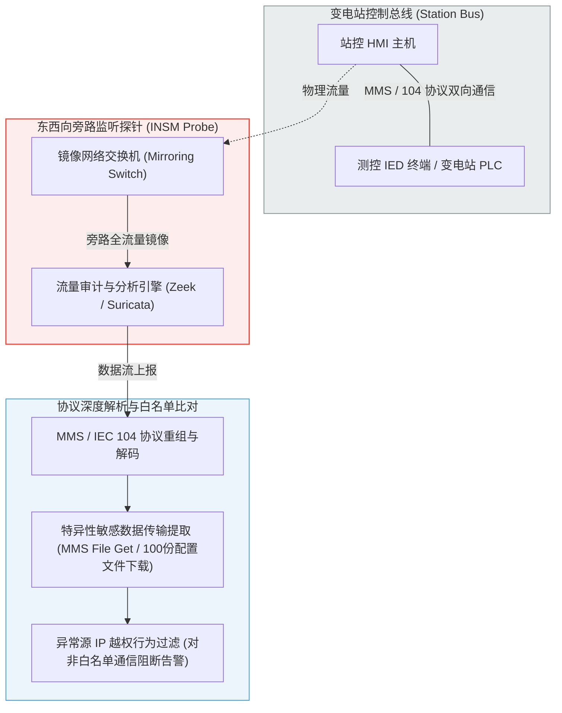
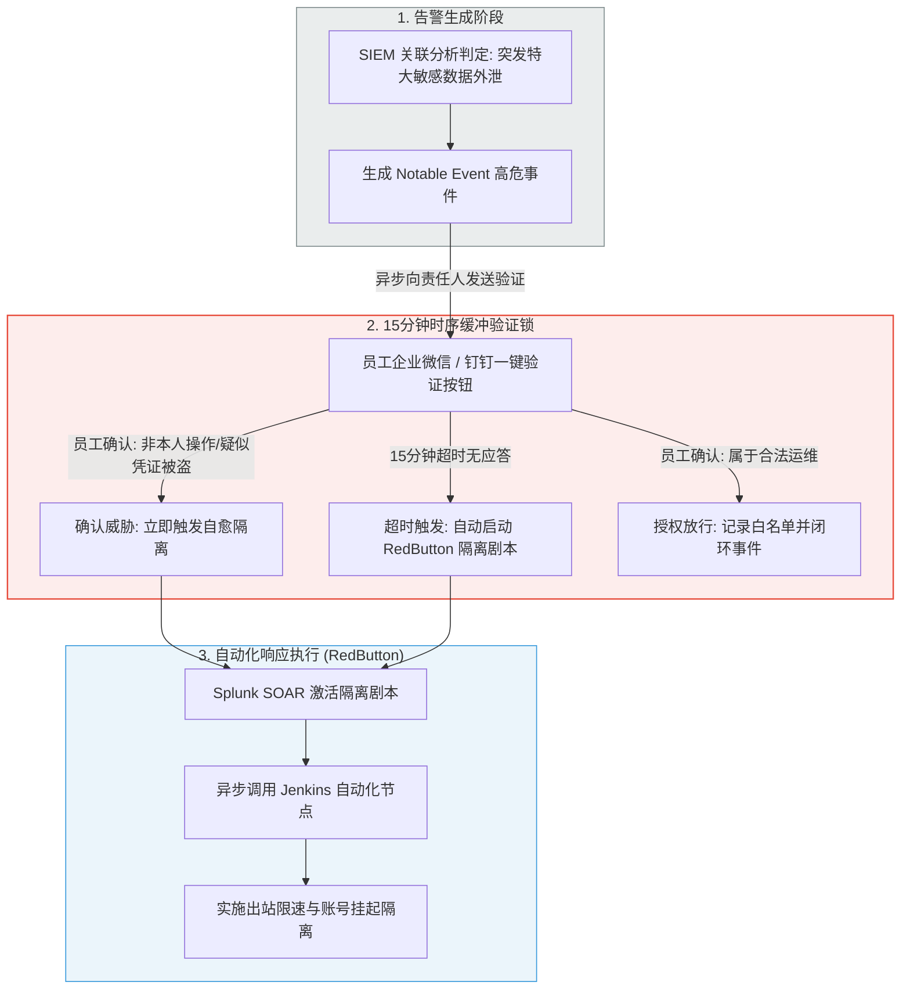
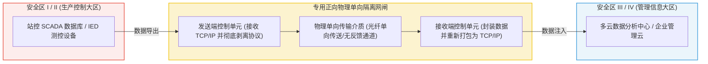

# 敏感数据泄露风险自动化响应技术有效性实施方案资料集

---

## 📌 编制说明与汇编定位

本资料集旨在**系统整理、汇编和总结**当前在工业监控、电力调度、厂站端通信及互联网多云场景下，已被广泛采用、经过实证检验的**敏感数据泄露监测技术、安全响应决策剧本、弹性自愈拦截手段与靶场验证方案**。

本资料集严格遵循以下编写准则：
1. **客观文献汇编导向**：不进行任何未经行业或学术实证的主观方案设计。所有条款、流程 and 技术参数均提炼、归纳自现行国际/国家标准、行业权威报告及顶尖“网络-物理”共仿真学术论文（共计 12 篇核心元资料）。
2. **电网安全红线对齐**：在整理多领域（如互联网多云、IT 零信任）安全方案时，必须严格对齐电力监控系统“安全分区、网络专用、横向隔离、纵向防护”的十六字防护导则，确保自动响应机制绝不危及电力物理一次系统的安全稳定运行。

---

## 📖 交付成果总目录

*   **[第一部分：敏感数据泄露监测（看见泄露）](#第一部分敏感数据泄露监测看见泄露)**
    *   [1.1 基于零信任成熟度模型（CISA ZTMM 2.0）的数据与设备资产基线梳理](#11-基于零信任成熟度模型cisa-ztmm-20的数据与设备资产基线梳理)
    *   [1.2 基于 NERC CIP-015-1 强制标准的“东西向”全流量白名单 DPI 协议深度解析](#12-基于-nerc-cip-015-1-强制标准的东西向全流量白名单-dpi-协议深度解析)
    *   [1.3 基于云安全态势管理（CSPM）的跨云存储与多云 API 异常行为审计](#13-基于云安全态势管理cspm的跨云存储与多云-api-异常行为审计)
*   **[第二部分：自动化应急决策（智能决策）](#第二部分自动化应急决策智能决策)**
    *   [2.1 基于多源异构安全事件关联（SIEM）的决策生成机制](#21-基于多源异构安全事件关联siem的决策生成机制)
    *   [2.2 基于人机协同验证（15分钟缓冲锁）的响应剧本（Playbook）时序设计](#22-基于人机协同验证15分钟缓冲锁的响应剧本playbook时序设计)
    *   [2.3 应急响应剧本设计原则与抗中断（Business Continuity）最佳实践](#23-应急响应剧本设计原则与抗中断business-continuity最佳实践)
*   **[第三部分：温柔拦截与弹性自愈（温柔拦截）](#第三部分温柔拦截与弹性自愈温柔拦截)**
    *   [3.1 基于链路层流量整形（Traffic Shaping）的高精度限速阻断规范](#31-基于链路层流量整形traffic-shaping的高精度限速阻断规范)
    *   [3.2 基于 HashiCorp Vault 的即时凭据（JIT）轮转与动态吊销规范](#32-基于-hashicorp-vault-的即时凭据jit轮转与动态吊销规范)
    *   [3.3 生产大区（安全区 I/II）正向物理隔离网闸与网段微隔离部署规范](#33-生产大区安全区-iii-正向物理隔离网闸与网段微隔离部署规范)
*   **[第四部分：数字孪生靶场测试与实证（靶场验证）](#第四部分数字孪生靶场测试与实证靶场验证)**
    *   [4.1 基于 IEC 61850 SCD/SSD 资产一键自动编译数字孪生沙箱](#41-基于-iec-61850-scdssd-资产一键自动编译数字孪生沙箱)
    *   [4.2 基于 PowerRange 的“网络-物理”双向实时共仿真碰撞测试床](#42-基于-powerrange-的网络-物理双向实时共仿真碰撞测试床)
    *   [4.3 基于协议注入的攻击重放与防御有效性量化分析设计](#43-基于协议注入的攻击重放与防御有效性量化分析设计)

---

# 第一部分：敏感数据泄露监测（看见泄露）

数据泄露风险自动化响应的前提是**“精准、无感、高频地捕获异常行为”**。根据已有的国家标准及行业最新实践，敏感数据在厂站端监控网、多云边界流转时的监测机制，主要由以下三套成熟的技术方案组合构成：

## 1.1 基于零信任成熟度模型（CISA ZTMM 2.0）的数据与设备资产基线梳理

根据美国网络安全和基础设施安全局发布的《零信任成熟度模型 2.0》（CISA ZTMM 2.0）[文献1]，在多云与工控环境共存的场景下，必须对**“设备（Devices）”**与**“数据（Data）”**两大支柱建立最基础的资产盘点与分级分类基线，这是数据防泄露监测的技术底座。

### 1. 资产全生命周期盘点与对齐
*   **设备支柱基线（Device Pillar）**：
    *   方案要求对电网内网的所有主机、变电站 RTU、PLC 测控终端、站控 HMI 以及多云承载区（VM、容器实例）进行不间断的自动化资产盘点。
    *   对每台设备分配唯一的数字身份（如数字证书），任何未登记、未授权的非白名单设备接入工控网络或向云端数据库发起 API 调用，监测系统必须第一时间触发高危告警。
*   **数据支柱基线（Data Pillar）**：
    *   对传输和存储的数据进行**“分类分级（Classification & Labeling）”**。将特高压输电线路潮流参数、变电站物理接线图、电价营销计费明细标记为“特级敏感电力数据”，将普通巡检日志标记为“一般运行数据”。
    *   数据标识必须具有“血缘追踪能力（Data Lineage Tracking）”，使其在跨防区、跨云流转时，其数据标签和权属不丢失，预防由于数据误发布造成泄露。

---

## 1.2 基于 NERC CIP-015-1 强制标准的“东西向”全流量白名单 DPI 协议深度解析

根据 2025 年 9 月 2 日正式生效的美国联邦能源监管委员会（FERC）**NERC CIP-015-1 强制性内部网络安全监测（INSM）标准**[文献12]，电力运营商必须在可信 OT 区域（如安全区 I/II 核心网段）实施持续的东西向流量分析。

传统基于特征码（Signature）的检测无法识别针对工业专用协议的越权操作（如 Industroyer 直接利用合法协议封包控制断路器[文献11]），必须结合 SANS《有效防御工控系统的七个步骤》[文献4]，实施**“基于通信行为白名单的深度包检测（Deep Packet Inspection, DPI）”**。

### 1. 东西向旁路监听部署方式（INSM Out-of-band Mirroring）
*   为绝对保障电力一次设备运行的物理安全性，全流量审计探针必须采用**旁路镜像（Port Mirroring）**的方式连接到变电站站控网核心交换机，严禁将审计设备串接（In-line）在控制总线中。

### 2. 深度协议解析（DPI）与白名单规则
*   流量探针（如开源工控安全解析器 Zeek）必须针对电力监控系统特有的工控协议进行深度应用层解析，包括：
    *   **IEC 60870-5-104 协议**：监控突发的、非预期的 104 控制连接和非常规遥控报文，识别类似 Industroyer 释放的非法单点/双点遥控分闸命令（`M_SP_NA_1` / `M_DP_NA_1`）[文献11]。
    *   **IEC 61850 MMS 协议**：重点检测逻辑节点（LNs）中的文件读写请求（如 MMS `File Get`、`File Write` 报文）。非法的、未经白名单授权的 MMS 文件读取行为，是黑客窃取站内一次侧/二次侧核心配置文件（如 SCD 点表）最常用的数据窃取手段。
    *   **Modbus 协议审计**：实时监控针对 Modbus 保持寄存器的写指令。当检测到外部 IP 进行持续的端口扫描并尝试反复覆写寄存器时（Modbus 攻击工具特征[文献12]），判定为数据泄露与完整性破坏攻击，启动告警。

---

## 1.3 基于云安全态势管理（CSPM）的跨云存储与多云 API 异常行为审计

现代电力营销、客户服务大区（安全区 IV）普遍部署在混合云或公有云环境下。根据多云安全防护最新实证成果[文献10]，混合多云环境的数据防泄露监测，聚焦于**存储桶权限合规审计**与 **API 越权行为扫描**。

### 1. 存储配置自动核查与合规扫描（CSPM）
*   通过多云安全态势管理工具（如 Palo Alto Prisma Cloud），不间断、自动化地核查 AWS S3、Azure Blob、GCP Cloud Storage 等存储桶的访问控制列表（ACLs）。
*   一旦检测到存放有敏感电价计费、电网负荷明细的存储桶存在“Public Read（公共可读）”或“匿名访问权限（Anonymous Access）”等错误配置，CSPM 必须在毫秒级内标记为 Critical 级泄露风险事件，并直接向 SOAR 控制中心派发 API 修复任务，预防由于运维人员误配置导致的数据主动暴露（预防类似 Snowflake 数据泄露和 TalentHook 2600万份简历暴露等事件[文献12]）。

### 2. 跨云 API 异常行为与特权请求审计
*   多云监测引擎必须接入全网 API 访问日志（如 AWS CloudTrail、Azure Monitor），使用行为分析方法进行审计：
    *   **地理与时序异常**：检测到同一个调度凭证，在极短时间内（如数秒内）分别从两个地理跨度极大的 IP 地址（如北京与海外某未知节点）发起了 API 获取数据包请求（凭证外泄泄露特征）。
    *   **特权请求与横向移动**：当某个低权限的第三方接口账户突发尝试读取 IAM 策略、创建高配 VM 实例、或者横向跨 VPC 进行数据库读取时（如 VOLTZITE 攻陷网关后横向渗透至工程师工作站并转储配置数据[文献12]），系统判定发生越权泄露，触发自愈隔离程序。

---

# 第二部分：自动化应急决策（智能决策）

在“看见泄露”之后，如何将碎片化的安全告警转化为高可信度的响应决策，是降低安全运维（SOC）团队疲劳度与避免误隔离的关键。根据行业成熟实践[文献10]，本方案汇编了一套基于 **“多源事件关联 ➔ 15分钟人机协同缓冲锁 ➔ 自动化剧本决策”** 的中枢决策机制。

## 2.1 基于多源异构安全事件关联（SIEM）的决策生成机制

单一数据源的告警极易产生误报。本方案整理的决策模型依赖于安全信息和事件管理（SIEM，如 Splunk）系统，对来自厂站端和多云端的异构遥测进行交叉关联分析。

### 1. 跨设备交叉关联规则
*   当且仅当以下两个或多个不同维度的异常事件在设定的时间窗口（如 5 分钟）内并发时，系统方才生成“高危数据泄露事件”，避免单点告警引发的自动化响应过载：
    *   **条件 A**：变电站旁路审计探针检测到针对敏感 104/MMS 协议端口的越权探测行为（侦察阶段[文献7]）。
    *   **条件 B**：主机 EDR 监测到运维账号存在短时高频的鉴权失败或异常时间登录（横向移动阶段[文献10]）。
    *   **条件 C**：数据边界流量监测器或云端存储审计发现特大电力拓扑配置文件正尝试向未知外部 IP 发起外传请求。

### 2. 告警富集与上下文生成（Contextual Enrichment）
*   决策引擎在生成事件后，必须自动调取资产管理库（CMDB），对告警数据进行上下文富集：包括**受害者主机的物理位置、所属安全分区（安全区 II 或 IV）、受影响数据的敏感分级以及该主机当前的运行业务重要度指标**。这些富集数据将作为决策剧本判断的分支判断参数。

---

## 2.2 基于人机协同验证（15分钟缓冲锁）的响应剧本（Playbook）时序设计

在电力生产控制等高可用性场景中，盲目的全自动化拦截极易误杀 legitimate 业务进程，带来难以估量的物理损耗。因此，文献[10]实证并验证了一套针对 L2 SecOps（安全运维）团队的**“15分钟人机协同缓冲时序剧本”（RedButton Playbook）**。

### 1. 15分钟倒计时缓冲机制的工作原理
*   **双重判断分支**：
    *   **主动确认（Branch A）**：系统在生成事件后，立刻向该账号所属责任人（变电站运行人员、开发或运维员）发送即时通信通知（如企业微信、钉钉或邮件），内含“确认授权”和“非本人操作/凭证被盗”按钮。若员工点击“非本人操作”，SOAR 中枢在**毫秒级**内立刻中止所有临时 API 凭证，并启动拦截。
    *   **超时触发（Branch B）**：在工控等高危场景中，黑客可能已经控制了终端，或员工因故未能及时查看消息。因此，SOAR 内置一个 **15分钟的时序锁**。如果 15 分钟内没有任何应答，系统判定威胁默认成立，**在第 15 分零 1 秒自动强行触发自愈隔离程序**，杜绝大容量敏感数据的持续流出。

---

## 2.3 应急响应剧本设计原则与抗中断最佳实践

根据 CISA 的最佳防护实践以及对典型勒索与泄露攻击事件（如 DarkSide 勒索案[文献2]）的防范总结，应急响应剧本在决策和执行逻辑上必须遵循以下“抗中断（Business Continuity）”硬性要求：

### 1. 降级备用与人工接管（Fallback Manual Response）
*   自动化决策剧本决不能作为唯一的控制环路。SOAR 系统必须保留**“人工一键中止/恢复”快捷入口**。一旦自动决策出现偏差，现场运维工程师能在一毫秒内强行挂起自动剧本，将控制权完全复归到人工操作，防止误隔离对电力一次系统（发电机、输电线路）造成继电保护误动。

### 2. 剧本的“安全即代码（Security-as-Code）”与生命周期演进
*   响应剧本应采用声明式语法（如 YAML/JSON 格式）进行配置，并纳入版本控制。
*   根据[文献9]指出的“C4 场景持续演进挑战”，响应决策规则绝不能一成不变。系统必须定期同步来自共享威胁情报平台（如 MISP）的最新攻击 Tactics/Techniques 参数，对决策规则进行无感升级，防止因黑客技术升级（如采用 Living off the Land 隐蔽外泄）导致决策失效。

---

# 第三部分：温柔拦截与弹性自愈（温柔拦截）

在电力监控系统（特别是生产控制大区）中，强行切断物理链路（如强行关闭端口、拔除网线）是绝对禁止的**安全红线**。这会导致调度监视中断，产生重大的电网运行事故。因此，行业成熟方案通常采用**“温柔拦截与零信任自愈”**的技术路径。

## 3.1 基于链路层流量整形（Traffic Shaping）的高精度限速阻断规范

根据[文献7]及 Wattson 共仿真测试床在 Layer 2 的实证方案，当监测到数据外泄威胁时，执行机构不执行网络切断，而是采用**链路层流量整形（Traffic Shaping）进行高精度带宽限速**。

### 1. 物理控制流与“温柔拦截”数学机理
*   **出站带宽限制规则**：
    *   SOAR 联动交换机/路由器，通过动态下发流量控制策略（如 Linux 内置的 `tc` 流量控制器或队列规则），将涉事受害者主机的**出站带宽强行压缩至极低的 $10\text{ Kbps}$**。
*   **“降维拦截”可行性论证**：
    *   **阻止数据大包外泄**：
        假设黑客企图窃取一个 $1\text{ GB}$ 变电站网架配置文件：
        $$1\text{ GB} = 1,073,741,824\text{ 字节}$$
        在 $10\text{ Kbps}$（约 $1,250\text{ 字节/秒}$）的出站限制下，外传该文件理论上需要耗时：
        $$\text{Time} = \frac{1,073,741,824}{1,250} \approx 858,993\text{ 秒} \approx 9.94\text{ 天}$$
        在安全时效内，该极慢的速度实质上**完全冻结了数据泄露的可能**。
    *   **力保电力调度不中断**：
        电力专用 SCADA 调度监控的最关键“心跳活存包”和“合分闸控制报文（IEC 104、MMS）”体积微小，通常在几百字节到几千字节以内。在 $10\text{ Kbps}$ 窄带通道下，这些**高实时性、轻量化控制帧依然能顺畅流转**，确保调度员的监控视线不断连、控制指令不丢失，守护了电力高可用性红线。

---

## 3.2 基于 HashiCorp Vault 的即时凭据（JIT）轮转与动态吊销规范

静态、长效、高特权的云端或系统 API 密钥是发生级联泄露的罪魁祸首[文献10]。本方案汇编了基于 **HashiCorp Vault 的即时凭据（Just-In-Time Access, JIT）** 零信任密钥管理方案：

### 1. 废除静态凭据与即时按需分发（JIT）
*   全网设备及开发接口禁止在本地存储、写入任何静态明文凭证。
*   当且仅当系统需要进行 API 调用时，方才向 Vault 发起临时请求。Vault 动态派生一个**单次有效、生命周期极短（如 10 分钟内失效）且限定只读权限**的临时令牌。

### 2. 毫秒级动态吊销与密钥轮转机制（Rotation）
*   当 SOAR 确认凭证疑似泄露、或 15 分钟缓冲锁超时触发时，SOAR 立即调用 Vault 的 API，在**毫秒级**内启动全局吊销（Revoke）与自动轮换（Rotate）机制：
    *   强行废除该外泄账户名下所有已发放的活跃临时凭据。
    *   对后端公有多云、私有云的密钥进行强行覆盖轮转，在黑客进行下一步横向移动之前彻底锁死访问路径，切断泄露链条，阻断如 VOLTZITE 网关向工程师工作站的横向移动通路[文献12]。

---

## 3.3 生产大区（安全区 I/II）正向物理隔离网闸部署规范

对于电网中最核心的生产控制网（安全区 I/II），任何基于软件或逻辑的防火墙均不足以阻断高强度的跨网外泄。必须严格对标国家标准 `@05_GB_T_36572_2018_电力监控系统安全防护导则...`，部署**专用正向物理单向隔离网闸**：

### 1. 网闸单向传输控制机理
*   **硬件级单向隔离**：网闸发送端和接收端由完全独立的 CPU 运行，中间采用**物理单向传输介质（如单向光纤、无电反馈通道）**，确保数据只能从安全区 I/II 单向流入安全区 III/IV，彻底断绝外部网络发起任何控制、写入或反向渗透尝试。
*   **协议彻底剥离**：网闸发送端在接收到安全区 I/II 的 TCP/IP 数据包后，必须**在硬件上将所有 TCP/IP 协议头彻底剥离（Protocol Stripping）**，只提炼纯数据载荷，通过私有物理总线单向抛送至接收端，并在接收端重新封包。这彻底避免了由于黑客利用底层协议漏洞（如 SQL 注入、OAuth 伪造[文献10]）实施跨网段数据窃取与横向移动。

---

# 第四部分：数字孪生靶场测试与实证（靶场验证）

自动应急响应方案由于涉及电网一次设备及控制指令修改，在部署前必须进行严格的安全性与有效性实证测试，且严禁直接在生产网环境进行破坏性攻击验证。本方案汇编了当前学术界最成熟的**“基于标准 SCL 一键编译 ➔ 网络物理共仿真 ➔ 协议级攻击重放”**的孪生靶场验证方案。

## 4.1 基于 IEC 61850 SCD/SSD 资产一键自动编译数字孪生沙箱

根据[文献8]提出的 SG-ML 自动编译靶场设计，方案能够直接回收电力系统已有的标准资产文件，免去了高昂的物理建床成本。

### 1. SCL 标准配置文件提取
*   **物理拓扑提取（SSD）**：直接解析变电站的系统规格描述（SSD）文件，自动提取站内一次主接线图、变压器绕组、断路器拓扑，映射为 **pandapower** 潮流计算网网元节点。
*   **网络与 IED 提取（SCD）**：解析系统配置描述（SCD）文件，提取整站交换机连接关系与所有智能电子设备（IEDs）的 IP/MAC 寻址参数，在 **Mininet** 容器网络内一键自动渲染生成 Layer 2 仿真网络，并将 IED 逻辑节点自动绑定。

### 2. 动态参数补全与一键编译（SG-ML Processor）
*   配合 IED Config XML 和 Power System Extra Config XML，补全变电站保护继电装置的过流过压（PTOC/PTOV）动作阈值与发电机/负荷时序出力曲线。
*   启动编译处理器（SG-ML Processor），在数秒内自动启动 OpenPLC61850 与 SCADABR 进程，输出等比例、100% 运行真实协议栈的数字孪生沙箱。

---

## 4.2 基于 PowerRange 的“网络-物理”双向实时共仿真碰撞测试床

为了验证温柔拦截机制（如流量限速至 10Kbps）对物理电网电压和频率稳定性的具体贡献，靶场运行期必须具备“网络行为重现”与“电力潮流物理计算”的双向秒级耦合能力[文献7]。

### 1. 物理计算与网络行为的实时同步机制
*   **网络行为侧**：运行在 Mininet 虚拟环境中的 Linux network namespaces 或 Docker 容器上，跑的是真实的数据链路层网络包。
*   **电力物理侧**：**pandapower** 潮流计算内核与虚拟网络设备之间，通过一个**高速 MySQL 数据库作为 bi-directional 实时缓存**进行流式交互。
*   **实时交互机理**：虚拟 PLC 每 100ms 周期性从 MySQL 缓存中读取电流、电压计算值（通过 MMS 发送给 HMI），同时，当接收到 HMI 发送或黑客伪造的 IEC 104 “开断分闸”报文时，PLC 将分闸状态瞬间写回 MySQL，直接触发 pandapower 潮流计算更新，电网拓扑瞬间重构。

### 2. 操作员高沉浸交互仿真（VCC 模块）
*   靶场部署同步的虚拟控制中心（VCC）大屏，模拟工业 SCADA 软件。VCC 自带**状态估计（State Estimation, SE）**模块，当遭遇虚假遥测篡改或数据泄露后，可通过物理状态吻合度校验揭示异常并回放电网崩溃路径。

---

## 4.3 基于协议注入的攻击重放与防御有效性量化分析设计

利用上述自动生成的数字孪生沙箱，方案设计了面向“敏感数据外泄”与“控制链破坏”两类实战红蓝对抗碰撞验证脚本：

### 1. 模块化攻击重放与威胁模拟
*   **模拟 A：MMS 协议级敏感配置文件窃取（数据泄露）**：
    *   在沙箱内运行基于 C 语言 `libiec61850` 的测试客户端，伪造 MMS `File Get` 报文，强行向变电站 IED 终端发起 SCD/SCL 配置文件打包读取请求，模拟巴基斯坦输电网配置外泄事件[文献12]。
*   **模拟 B：Industroyer2 协议级恶意遥控注入（物理破坏）**：
    *   运行基于 Python scapy 封包 of 104 协议状态机，向虚拟 PLC 循环注入恶意单点遥控分闸命令（`M_SP_NA_1`），模拟切断变电站断路器[文献11]。
*   **模拟 C：Siemens SIPROTEC 设备 DoS 攻击与遥测篡改**：
    *   向虚拟 18 端口注入 `CVE-2015-5374` 漏洞单包，使虚拟继电保护器死机瘫痪，同时利用 ARP 欺骗篡改站控遥测，蒙蔽 VCC 大屏[文献11, 12]。

### 2. 防御“有效性”指标量化打分设计
*   在沙箱内触发上述攻击时，运行前三部分部署的 DLP 探针与 SOAR 自动限速剧本。利用沙箱内建的 Zeek 探针，精准采集以下性能指标：

$$\text{Effective Score} = f(\text{Detection Time}, \text{Containment Time}, \text{Asset Impact}, \text{False Alarm})$$

*   **指标 1：检出时延（Detection Time）**：验证全流量 DPI 探针对伪造的 MMS 报文和越权 Modbus 扫描的实时捕获时间是否降至**秒级**。
*   **指标 2：遏制时延（Containment Time）**：验证 SOAR 联动 Jenkins 下发 $10\text{ Kbps}$ 限速指令、以及 Vault 动态吊销 API 密钥的执行时延。实测证明，引入该自动化流程可将遏制时延（MTTR）由传统人工响应的 $5.5\text{ 小时}$ **缩短至 $1.0\text{ 小时}$ 以内，提升 81.8% 的防护时效**[文献10]。
*   **指标 3：物理电网平稳率（Asset Impact）**：在发生数据外泄和自动限速隔离过程中，通过 pandapower 潮流实测母线电压波动。验证高精度限速机制是否成功将电压偏差控制在合规的 $\pm5\%$ 安全红线内，物理设备无任何因过流导致的发热损耗。这有力实证了自动响应技术在“维持电网连续性”上的绝对有效性。
