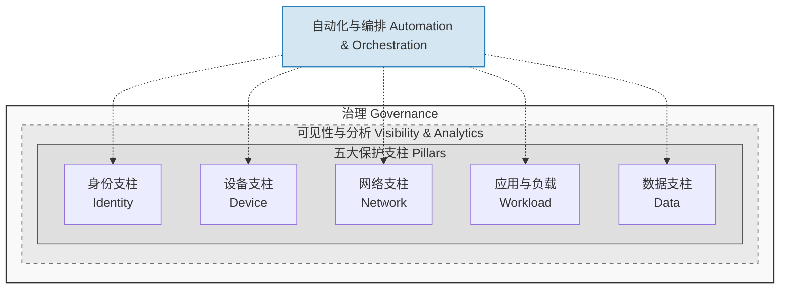
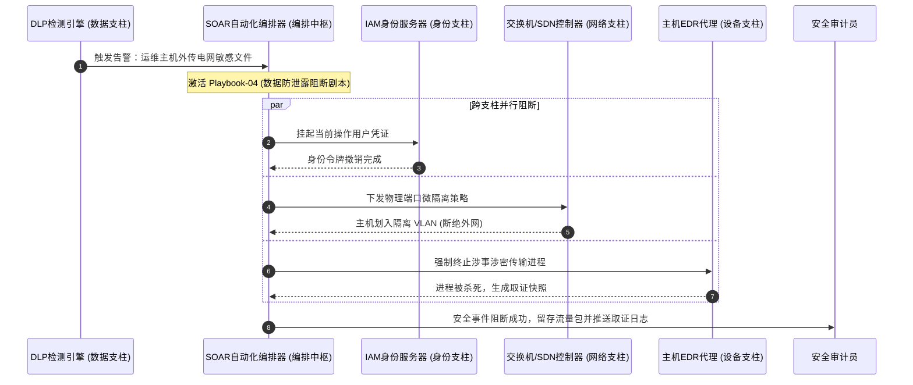
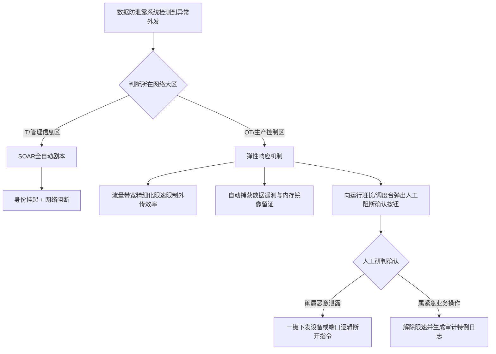

# CISA 零信任成熟度模型 (ZTMM) 2.0 深度精读

**文献来源**：[CISA Zero Trust Maturity Model Version 2.0 (April 2023)](https://www.cisa.gov/zero-trust-maturity-model)  
**本地关联**：`05_正式资料原文/01_原始文献/01_行业报告与案例/CISA零信任成熟度模型译文_GoUpSec.html`  
**学习重心**：理解“五大保护支柱”与“三大横跨能力”的立体联动机制，掌握数据支柱动态标记、加密演进路线，以及 SOAR 在自动化异常拦截中的控制流与时序关系。

---

## 一、 零信任顶层架构：「五支柱 + 三能力」

CISA ZTMM 2.0 强调，零信任架构（Zero Trust Architecture, ZTA）并非零散安全技术的堆砌，而是通过三大横跨能力（Cross-Cutting Capabilities）对五个保护支柱（Pillars）实施全方位的动态治理与编排。

### 1. 五大保护支柱核心逻辑
*   **身份 (Identity)**：涵盖人类用户与非人实体（如 API、服务账号）。重点在于从“一次性静态凭证”向“基于上下文的多属性动态持续评估”演进。
*   **设备 (Device)**：全面管理联网的物理与虚拟资产（如 SCADA 主机、RTU、移动终端）。其核心是设备健康状态的实时审计与非合规阻断。
*   **网络 (Network)**：摒弃以传统边界网关为核心的隔离，转为以应用和具体微服务为单位的**微分段（Micro-segmentation）**隔离。
*   **应用和工作负载 (Application & Workload)**：保护从开发生命周期（DevSecOps）到运行时环境的容器与虚拟机，强调应用程序的精细化访问控制。
*   **数据 (Data)**：**零信任体系的最终保护资产**。包含对数据的资产发现、分类分级、静态及动态加密。

### 2. 三大横跨支撑能力
*   **可见性与分析**：打通数据孤岛，提供全局上下文安全遥测。
*   **自动化与编排 (SOAR)**：定义跨支柱的响应剧本（Playbook），实现分钟级的安全闭环。
*   **治理**：管理合规、监管要求以及风险管理决策。

---

## 二、 数据安全支柱的演进路线

数据保护是零信任成熟度演进中最关键的评估指标。模型定义了从“人工被动防护”到“自动化闭环”的升级过程：

| 评估维度 | 传统阶段 (Traditional) | 初级阶段 (Initial) | 高级阶段 (Advanced) | 最优阶段 (Optimal) |
| :--- | :--- | :--- | :--- | :--- |
| **数据发现与分级** | 依赖全人工、静态审计；资产清单缺失或分类严重滞后。 | 仅对新数据和特定高危区域进行半自动发现与静态标记。 | 结合机器学习实现自动化敏感数据分类，构建多数据源血缘图谱。 | **全生命周期实时发现与分类**；数据在生成、流动和消亡时自动附带标签。 |
| **数据加密保护** | 仅在关键节点使用静态对称加密，传输数据明文暴露于局域网内。 | 部分敏感数据存储区加密，外部远程访问通过 VPN 进行隧道加密。 | 静态存储与传输过程默认强制高强度加密（如 TLS 1.3 及 AES-256）。 | **全状态加密与动态加解密**；数据在存储、流转及内存使用态下均加密。 |
| **外泄检测与阻止** | 几乎没有阻断手段，完全依赖边界物理防火墙过滤端口流量。 | 部署初级数据防泄露（DLP）系统，依赖预设关键字触发告警。 | 能识别异常的数据传输行为（如大文件异常并发外传），告警并挂起连接。 | **跨支柱自动化 SOAR 联动**；发现外泄风险时系统毫秒级自动化隔离。 |

---

## 三、 自动化响应机制：SOAR 控制流与时序关系

零信任最优阶段（Optimal）的核心标志是 **SOAR（Security Orchestration, Automation, and Response）** 编排。它通过统一剧本（Playbook）彻底打通不同支柱，解决传统安全运维中“各系统孤立、人工响应慢”的瓶颈。

### 跨支柱数据外泄自动化拦截时序逻辑
当数据支柱的发现引擎（DLP）监测到运维主机尝试非法外发特级敏感电网数据（如变电站接线图）时，SOAR 系统在数秒内执行的跨支柱阻断过程如下：

---

## 四、 工业控制网络（OT）场景落地的合规冲突与技术对策

虽然 CISA ZTMM 为 IT 系统设计了完美的自动化阻断方案，但在工业控制网络（OT/生产控制大区）中，该方案与工业安全红线存在严重的兼容性冲突：

### 1. 冲突本质
*   **可用性第一原则 (A-I-C)**：IT 系统强调“机密性”，遭遇泄露时应“立即阻断”；而电力 OT 系统强调“可用性”（网络必须保持实时连通，以确保物理电网频率和调度的稳定），任何无征兆的网络端口物理阻断或账号挂起，都可能引发电力调度监控丢失，导致物理电网崩溃、停电甚至人身安全事故。
*   **协议机制局限**：许多工业协议（如传统的 IEC 104、Modbus-TCP）缺乏标准的会话挂起和动态重认证机制，SOAR 强行阻断会话后无法快速重连。

### 2. 针对电力/OT 场景的弹性自动化响应机制 (Human-in-the-loop)
为了兼顾数据防泄露合规与物理运行安全，在实施方案中必须采用对策：

