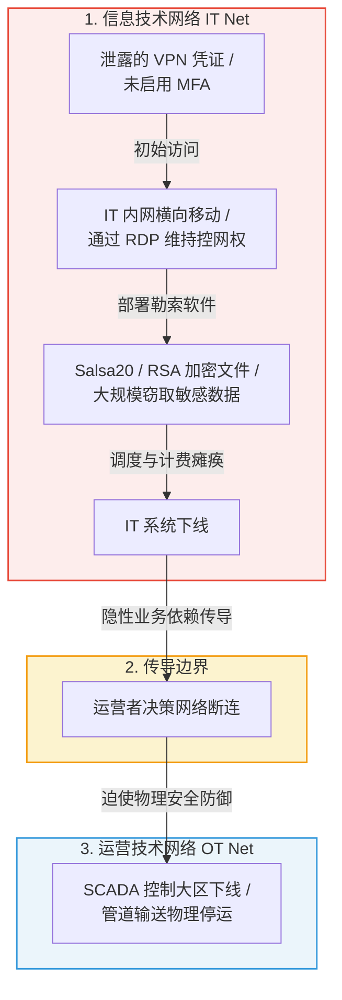
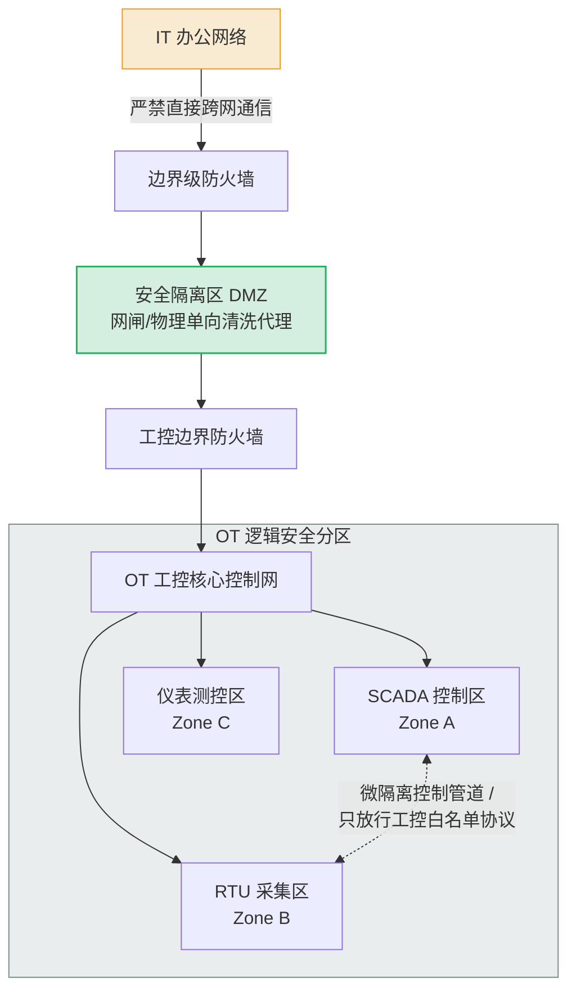
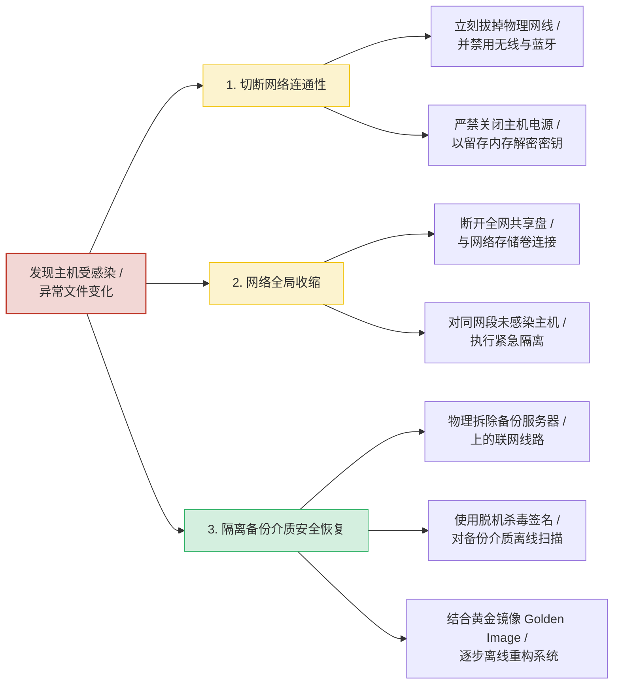

# DarkSide 勒索软件：防止勒索攻击导致业务中断的最佳实践

**文献来源**：CISA / FBI Joint Cybersecurity Advisory (AA21-131A)  
**本地关联**：`05_正式资料原文/01_原始文献/01_行业报告与案例/DarkSide勒索软件_防止勒索攻击导致业务中断最佳实践_AA21-131A.html`  
**学习重心**：掌握 IT 网络安全漏洞如何向上蔓延并迫使物理 OT 网络关停的故障传导机理，学习基于 DMZ、微分段及微隔离的 IT/OT 强隔离管道，以及保障物理连续性的离线隔离备份（Air-gap）与手动控制韧性体系。

---

## 一、 工业安全灾难传导机制：Colonial Pipeline 事件的物理与逻辑边界联动

本通告的核心技术启示在于：**即便恶意代码没有直接侵入和感染工业控制网络（OT），IT 网络与运营网络在系统和业务上的隐性依赖，依然会导致灾难向物理边界传导，迫使生产和运行主动或被动全面停摆。**

### 关键攻击手法与防御对照 (MITRE ATT&CK v9)

| 攻击阶段 | 技术实现路径 | 防御策略与自动化对策 |
| :--- | :--- | :--- |
| **初始访问 (Initial Access)** | 利用泄露的旧版远程 VPN 账户（缺乏多因素认证限制），通过公网系统漏洞注入初始流量。 | 强制在 IT 与 OT 网络所有入口部署多因素认证（MFA），对远程会话建立超时自动断开策略。 |
| **持久化 (Persistence)** | 绕过安全检测，利用远程桌面协议（RDP）或合规运维通道在 IT 内网建立持久交互环境。 | 关闭非必要 RDP 通道，严格基于物理网络边界进行源地址访问白名单限制。 |
| **命令与控制 (C2)** | 通过 Tor 匿名网络通道或 Cobalt Strike 后渗透控制端规避边界防火墙流量监测，外传数据。 | 实施实时流量分类监控，强制阻断已知 Tor 节点连接，部署并不断更新后渗透控制端特征库。 |
| **影响与破坏 (Impact)** | 运用 Salsa20 对关键数据加密，结合 RSA 加密公钥上锁，强制擦除本地“卷影副本（Shadow Copies）”。 | 建立底层文件变化监控和进程拦截；部署软件执行黑白名单策略，阻断 AppData 目录下未签名程序运行。 |

---

## 二、 提升关键基础设施“业务韧性”（Business Resilience）的核心机制

面对以数据加密和勒索威胁为手段的安全攻击，防御策略的重心除了前端“硬防阻断”外，更在于保障系统在“受灾态”下的物理运行能力，即提升系统韧性。

### 1. IT 与 OT 强网络分段（微分段边界隔离）

*   **物理单向网闸与中转 DMZ**：IT 网络与 OT 网络之间不存在任何不受控的跨网直连会话。所有业务数据流必须在中转 DMZ 经过彻底的“协议清洗”，只放行高可信的定制化报文。
*   **工控大区微隔离分区**：将 OT 内部按功能进一步隔离，不同工艺区、变电站之间定义专属通信控制协议白名单，阻断恶意代码在工控网中横向移动。

### 2. 离线物理隔离备份（Air-gapped Backups）
*   **勒索软件的破坏机制**：勒索病毒进入系统后，首要任务是扫描并搜寻局域网共享盘、磁盘阵列等所有处于“挂载态”的备份。因此，普通的在线热备份通常会与生产系统同步被加密。
*   **技术机制 - Air-gap（气隙）**：
    *   备份服务器或介质必须在逻辑甚至物理层面上独立于主通信网络。
    *   备份程序仅在备份调度的有限时间内动态开启防火墙端口、连接存储媒介；备份完毕后自动拆除网络连通性，使备份数据长期处于不可访问、物理离线的“冷状态”，彻底斩断勒索病毒的加密路径。

### 3. 物理系统手动控制韧性（Manual Control）
*   **对策机理**：系统韧性的终极要求在于“当网络彻底瘫痪甚至全部物理断网时，生产依然不能中断”。
*   **手动控制设计**：油气输送管道、电网变电站的继电保护等核心生产设备必须设计并预留完全独立于控制网络的“本地硬接线手动控制”回路。
*   **演练规范**：运营方必须将“脱离一切自动控制网络，依靠运行人员现场手动进行调度和断路器分合闸”作为必修应急演练科目，确保受灾态下的最低限度物理安全运转。

---

## 三、 突发勒索软件事件的应急自动化响应规程

