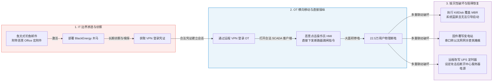

# 乌克兰关键基础设施网络攻击事件（BlackEnergy & KillDisk）深度精读

**文献来源**：ICS-CERT Industrial Control Systems Joint Cybersecurity Alert (IR-ALERT-H-16-056-01)  
**本地关联**：`05_正式资料原文/01_原始文献/01_行业报告与案例/乌克兰关键基础设施网络攻击_IR-ALERT-H-16-056-01.html`  
**学习重心**：深度解构全球首例导致大规模物理断电的网络攻击全生命周期，重点分析“凭证窃取+远程SCADA操纵”的直接攻击链路，学习 KillDisk 擦除主引导记录（MBR）、串口网关固件覆写、UPS定时硬断连等全方位物理阻碍恢复的技术手段。

---

## 一、 灾难演进机制：从信息外泄、凭证窃取到物理操纵的完整攻击链

乌克兰电网事件（2015年12月23日）的技术本质，是攻击者**以 IT 侧恶意软件作为跳板进行数据嗅探与凭证窃取，最终横向移动进入 OT 侧，直接利用合法 SCADA 客户端权限执行恶意物理控制指令**。

---

## 二、 攻击尾声的毁灭性破坏技术（KillDisk 及硬件致瘫分析）

该事件最显著的技术特征是在攻击收尾阶段，攻击者实施了全方位、跨介质的软硬件毁灭性破坏。其目的不仅在于销毁攻击痕迹，更在于**彻底剥夺运行人员的“远程视线”与“应急接管能力”，延长物理电力恢复时间。**

### 1. KillDisk 恶意软件作用机理
*   **文件与日志擦除**：遍历操作系统中的系统日志与安全审计日志，执行不可逆的物理覆盖填充，使取证分析失效。
*   **MBR（主引导记录）破坏**：擦除并改写磁盘的主引导记录，致使操作系统直接瘫痪并进入死循环，无法重启。
*   **覆盖 HMI 运行单元**：在部分变电站， KillDisk 直接覆盖了嵌入式 RTU（远程终端单元）或 HMI 面板的本地控制系统，彻底中断了现场级的监控视线。

### 2. 串口网关固件覆写（Bricking Serial-to-Ethernet Converters）
*   **传统电力 OT 的传输痛点**：许多变电站的核心物理设备（如断路器、继电器保护装置）依靠旧款 RS-232/485 串口与交换机相连。站内采用“串口转以太网设备”（Serial-to-Ethernet Converters）将串口流量封装为 IP 报文上传给调度中心。
*   **致瘫机制**：攻击者通过网络向这些网关设备恶意推送了**垃圾固件并实施覆写**。由于网关硬件底层引导程序被损毁，设备彻底“变砖”（Bricking），即使电网调度端网络重建完毕，也无法再通过远程下发控制指令，迫使电力工程师必须在严寒中驱车前往几十个物理变电站，逐一手动将硬件断路器闭合。

### 3. UPS（不间断电源）远程改写
*   **致瘫机制**：攻击者在通过 VPN 侵入控制网络后，并未放过机房的 UPS 远程管理接口。他们通过网络连接登录 UPS 控制后台，修改了内置定时器设定（设置在断电数分钟后，UPS 主动关断自身输出电源）。
*   **攻击效果**：当电网停电、调度中心转由本地蓄电池/UPS 供电维持网络监控时，定时器触发，UPS 强制关断，导致调度中心的所有后备服务器、监控大屏在最紧急的恢复关头彻底断电黑屏。

---

## 三、 对抗直接物理操纵攻击的电力安全防护要点

乌克兰电网事件证明，传统的“防恶意代码注入”在“凭证泄取+合法客户端操纵”面前完全失效。电力大区必须执行更高层级的控制防护：

### 1. 消除任何软件层面授权的“只读”幻想
*   **技术漏洞**：很多传统控制系统对供应商、外网提供的“只读监测”访问权限完全基于应用层软件配置。攻击者一旦攻破该软件（或利用溢出漏洞），只读权限可轻易被提升为“读写控制”权限。
*   **防御机制**：如果需要从 OT 控制大区向外（如向 IT 办公网、生产调度中心外）外传数据，必须在物理边界上部署**光学隔离单向网闸（Data Diodes）**。数据物理上只能单向流出，任何反向的电信号/光信号在物理层面被切断，彻底隔绝黑客反向渗透下发控制指令的通道。

### 2. 基于“挂牌锁闭（LOTO）”逻辑的远程控制安全
*   **技术机制**：禁止工控网络中任何对核心物理设备（如断路器）的“永久在线远程控制权”。
*   **对策（远程控制动态锁定）**：
    *   日常控制链路默认为锁定（Lockout）状态，远程控制命令无法下发。
    *   当需要进行远程操作时，必须通过现场运维人员物理按下“解锁按钮”，或通过本地双人协同鉴权，给予远程操作一个限时的（如 10 分钟）控制窗口。
    *   控制窗口一旦超时，链路物理断开，防止黑客通过窃取的凭证进行非授权、无征兆的远程越权控制。

### 3. 工控 HMI 应用程序白名单（AWL）
*   **技术机制**：在调度主机、数据库服务器、HMI 人机交互终端上强制部署应用程序白名单基线。
*   **防御效果**：在白名单外，任何新生成的未授权可执行程序（如 KillDisk 释放的临时文件、木马后门）在底层直接被操作系统拦截，无法运行，避免攻击收尾时的系统自我毁灭。
