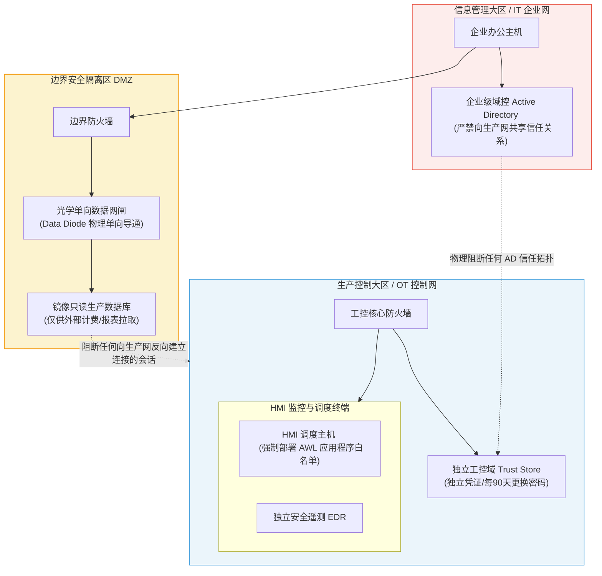

# 有效防御工业控制系统 (ICS) 的七个步骤：深度精读

**文献来源**：CISA / NCCIC / SANS Joint Whitepaper: *Seven Steps to Effectively Defend Industrial Control Systems* (S508C)  
**本地关联**：`05_正式资料原文/01_原始文献/01_行业报告与案例/Seven Steps to Effectively Defend Industrial Control Systems_S508C.pdf`  
**学习重心**：掌握由工控防御大师 Michael Assante 等总结的 7 大工控纵深防御守则，深入学习“凭证/域控强物理隔离”、“光学单向隔离（Data Diode）”与“限时限控 LOTO 远程访问”的底层控制链路，建立保障 98% 常见工控网络事件得以免疫的安全防御底座。

---

## 一、 顶层架构设计：高抗灾性工控防御体系图

本白皮书指出，防御现代高级持续性威胁（APT）必须摒弃单纯依赖“边界防护”的幻想。通过在**应用白名单、独立域控（Trust Store）、单向数据二极管、微分段隔离**四个维度的立体联动，可建立高度安全的工控运行环境。

---

## 二、 工业控制系统防御的七大核心策略深度解析

通过对 ICS-CERT 响应的真实安全事件进行统计，若资产所有者全面落实以下七大策略，**可成功预防并阻止 98% 的工控网络安全事件**，剩余 2% 的高级威胁亦可通过持续监控和快速响应予以消减。

### 1. 部署应用程序白名单 (Application Whitelisting, AWL)
*   **技术机制**：在 HMI（人机交互界面）、历史数据库服务器和工程师站等**高度静态化**的系统上，强制推行 AWL。除经预先签名验证的合法二进制文件外，默认拦截任何第三方新文件的执行。
*   **对抗案例**：ICS-CERT 曾处置过某起重大安全事件，受害者由于完全依赖杀毒软件，导致 80% 的终端被未知新型病毒感染，被迫重建全网。由于该新型恶意代码在 VirusTotal 上的检出率为 0%，唯有基于“默认拒绝”原则的 AWL 能直接在底层阻止其启动。

### 2. 严格执行配置与补丁管理 (Configuration & Patch Management)
*   **技术机制**：
    *   构建精准的资产台账基线，优先对使用 PC 架构的 HMI、数据库、网关设备实施配置强化与补丁修补。
    *   **限制外部设备接入**：严禁供应商携带未受控的外部笔记本电脑直连工控网。必须由企业统一提供经过加固和离线扫描的“已知安全”专用运维电脑。
    *   **防范供应链“水坑攻击（Watering Hole）”**：从外网下载 patches 后，必须在离线测试沙箱（内置病毒检测）中测试运行；必须通过带外信道（Out-of-band，如邮件列表或官方签名信道）校验补丁的 Hash 散列值。
*   **对抗案例**：工控巨弹 Stuxnet 对某发电厂的初始感染向量，即为一台被污染的供应商运维笔记本电脑；而 HAVEX 恶意软件则是直接通过污染厂商官网上的补丁安装包（水坑攻击）进行供应链渗透。

### 3. 收缩网络攻击面 (Reduce Attack Surface Area)
*   **技术机制**：
    *   将 ICS 核心控制网络与外部不信任网络（特别是公共互联网）实施物理隔离。
    *   关闭所有未使用的物理端口，禁用未使用的服务协议。
    *   若业务仅需单向数据传输（例如财务计费系统需要提取管道输油量），**强制使用光学数据网闸（Data Diode）**，绝不留下反向通信物理链路。
*   **对抗案例**：ICS-CERT 指出，全球有超过 8.2 万台工控物理设备直接暴露在公共互联网上，导致包括美国大坝、多国水厂等关键基础设施极易遭到直接越权控制。

### 4. 构建可防御的逻辑隔离边界 (Build a Defendable Environment)
*   **技术机制**：在工控网内部实行**逻辑安全分区（Logical Enclaves）**。限制主机与主机之间的任意对等通信，仅放行明确需要的控制通路。
*   **对抗案例**：
    *   某核电站由于未对物理介质执行入场扫描，导致在工控 3 级大区引入了恶意病毒。然而，得益于内部实施了极佳的分区隔离，病毒最终仅波及了 6 台设备。
    *   某管道运营商曾将企业管理网与管道控制网直连，理由是“计费部门需要实时计量流量”。在 CISA 警示其断开连接后，计费部门在第 4 天才意识到网络断开。这证明所谓“IT/OT 实时业务依赖”在多数情况下是伪需求，完全可以用单向网闸或离线介质拷贝替代。

### 5. 凭证与身份管理隔离 (Manage Authentication)
*   **技术机制**：
    *   工控网和企业网（IT网）**必须使用完全独立、物理隔离的凭证存储介质与认证服务器**。严禁跨 IT/OT 共享 Active Directory（活动目录/域控）或 RSA 认证服务器。
    *   对工控网内部所有服务账号、非交互账号，配置唯一的、长度优先于复杂度的强密码，并强制每 90 天执行 100% 密码重置。
*   **对抗案例**：某政府机构在局域网内所有本地管理员账户上套用了同个静态默认密码，导致黑客在攻入一台外围主机后，在数分钟内便横向移动控制了全网所有设备。

### 6. 实现安全的受控远程访问 (Implement Secure Remote Access)
*   **技术机制**：
    *   **杜绝持久连接**：严禁供应商或外部人员在控制网络中保留永久激活的远程连接。
    *   **LOTO（挂牌锁定）操作规程**：远程访问连接默认必须处于物理/逻辑切断状态。只有在运维需要时，由现场操作员人工核准并手动开启，限时释放控制权（如 30 分钟），到期自动物理切断。
    *   **物理单向化**：外部远程连接仅允许通过数据网闸提供“只读画面监控”，不提供任何基于软件授权的远程写入和远程控制指令。

### 7. 持续性主动监控与响应恢复 (Monitor and Respond)
*   **主动防御遥测点**：
    1.  **边界网关**：持续审计网络边界的流量，识别非授权和异常端口通信。
    2.  **工控内网**：利用工控协议审计引擎对 DNP3、IEC 104、Modbus 等内部明文报文执行异常控制指令基线匹配。
    3.  **主机监控**：对 HMI、工控服务器执行系统日志与权限变动监控。
    4.  **身份审计**：分析登录时间、物理位置与行为异常，一旦发现非工作时间登录立即人工电话核实。
    5.  **应急恢复**：建立基于**“黄金镜像（Gold Disks）”**的快速恢复机制。在遭遇 KillDisk 或 Shamoon 等毁灭性磁盘擦除攻击时，不花费时间进行杀毒或排查，直接物理覆写黄金镜像，一键导入离线冷备份数据重建调度大区。
