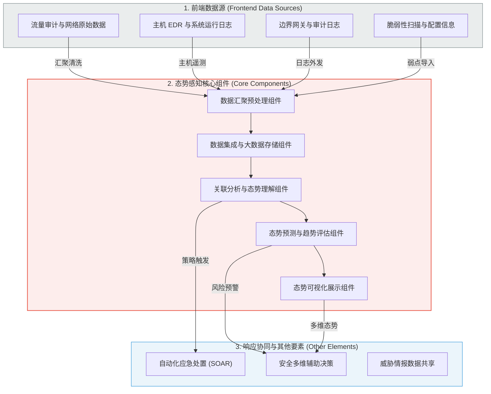
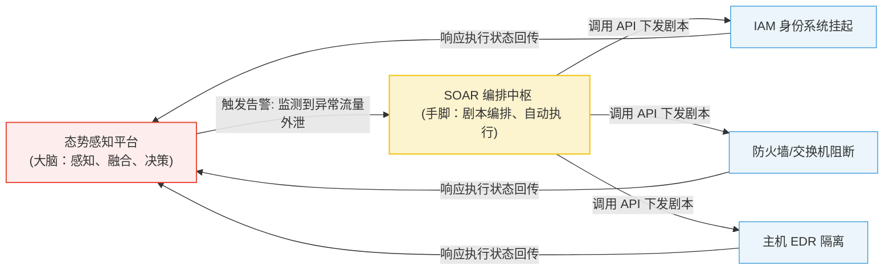

# GB/T 42453-2023《网络安全态势感知通用技术要求》深度精读

**文献来源**：国家标准 GB/T 42453-2023《信息安全技术 网络安全态势感知通用技术要求》  
**本地关联**：`05_正式资料原文/01_原始文献/02_国家标准与指南/GBT+42453-2023.pdf`  
**学习重心**：掌握国家标准对网络安全态势感知（Situation Awareness, SA）的顶层技术框架设计，深度剖析数据汇聚、大数据集成存储、关联分析、态势理解与预测核心组件的技术合规指标，理解态势感知如何作为“神经中枢”与 SOAR 自动化响应协同联动。

---

## 📌 标准定位声明与项目合规边界

在开展“电力监控系统敏感数据泄露异常风险自动化响应技术”的研究中，必须以极其客观、理性的视角审视本标准的定位与适用边界：

1. **非电力专属性（General IT Scope）**：
   本标准是由全国信息安全标准化技术委员会（TC260）制定的**通用性网络安全国家标准**。标准条文中完全未涉及任何电力专用协议（如 IEC 104、DNP3、GOOSE）、电力调度专用拓扑或厂站监控特征。因此，**坚决不能将本标准作为“电力监控专有数据防泄露算法”的直接技术源资料**。
2. **非执行态防护（Brain vs. Execution）**：
   本标准规范的是“态势感知（大脑中枢：发现、分析、融合与决策）”，而非“终端/边界防护（执行机构：网闸隔离、阻断、加密）”。它在数据泄露防护（DLP）上的核心价值，在于**提供如何将多源异常日志（如网闸异常外发与 EDR 异常读取）进行 CEP 关联分析、并将决策传递至下游执行机构的“合规评估指标”**。
3. **安全红线防区（Human-in-the-loop Gating）**：
   本标准在定义“应急处置/协同要素”时，多采用通用 IT 场景的“全自动阻断连接”逻辑。而在电力 OT 生产控制大区中，此种做法极易因网络断连导致“电力调度监控视线丢失、继电误动拒动”等重大安全事故。在具体技术应用中，**必须将本标准的自动化控制链路进行降级，强制嵌套“人工二次确认（Human-in-the-loop）”的安全隔离防区**。

---

## 一、 网络安全态势感知通用技术框架

根据标准第 5 章的定义，网络安全态势感知通用技术框架由**前端数据源**、**核心组件**与**其他要素（应急响应、数据共享等）**三部分共同构成：

### 1. 前端数据源 (Frontend Data Sources)
态势感知的原材料。标准强调，前端数据源必须提供全方位、多维度的安全遥测，覆盖网络流量、系统终端、安全边界以及外部威胁信息（Threat Intelligence）。

### 2. 核心组件 (Core Components)
态势感知的处理中枢。它是实现态势感知能力的重要技术手段，表现形式可为产品、系统或平台。数据在核心组件内经历：**采集汇聚 ➔ 规范存储 ➔ 交叉关联分析 ➔ 态势建模预测 ➔ 最终可视化大屏展现**的完整流水线。

### 3. 其他要素 (Other Elements)
态势感知的闭环出口。态势感知并非“只看不动”的静态监视器，它依赖于应急响应处置（SOAR 联动）、安全决策支持（风险评定）以及数据共享机制（规范威胁情报格式，兼容 GB/T 36643-2018），实现“感知 ➔ 决策 ➔ 响应”的动态循环。

---

## 二、 核心组件技术指标与功能要求

标准对框架中定义的核心组件规定了极其具体的通用技术合规要求：

### 1. 数据汇聚预处理组件
*   **多源异构适配**：应支持采集包括 syslog、NetFlow、WMI、HTTP API、SNMP、Kafka 报文在内的至少十种以上数据源格式。
*   **归一化处理（Normalization）**：应能去除冗余、重复、无效的干扰日志；将不同安全设备自定义的非标准日志清洗并转换为符合标准的归一化事件。

### 2. 数据集成与大数据存储组件
*   **高吞吐集成**：应支持分布式消息队列，具备每秒数万级（EPS）的高并发数据摄入能力。
*   **多维关联索引**：对海量资产元数据、漏洞信息、基础网络拓扑进行统一的实体对齐，实现多源数据的分布式高并发索引存储。

### 3. 关联分析与态势理解组件
*   **跨设备交叉关联**：应支持内置规则、复杂事件处理（CEP）与行为分析模型。例如，能将“DLP 阻断日志”与“主机 EDR 异常文件读取”以及“防火墙边界向外发起的未知 C2 会话”进行跨设备、跨维度的交叉关联，复现完整的 APT 攻击链。
*   **攻击链匹配度量**：应能将检测到的异常行为映射到已有的攻击分类矩阵（如 MITRE ATT&CK 知识库），精准评定威胁所处的演进阶段。

### 4. 态势预测与趋势评估组件
*   **攻击面与路径预测**：根据资产中现存的漏洞、特权账户分布，结合攻击者的活动轨迹，**自动推演黑客的横向移动和向外泄露数据的潜在路径**。
*   **威胁度趋势计算**：量化输出系统未来一段时间内面临的风险趋势指数，触发高危预警。

### 5. 态势展示与管理组件
*   **可视化呈现**：提供多维安全视角（资产态势、威胁态势、脆弱性态势等）的动态渲染。
*   **统一策略配置**：集中管理分析模型、归一化规则、过滤基线和资产全生命周期变动日志。

---

## 三、 态势感知（SA）与 SOAR 自动化响应的协同链路

GB/T 42453-2023 将“应急处置组件”列为核心框架的协同要素，实质上定义了**“态势感知（感知大脑）与 SOAR 剧本（执行手脚）”**的联动准则：

### 感知大脑与执行手脚的控制流

*   **态势感知（大脑角色）**：负责跨设备收集并整合威胁数据。例如在检测到生产控制网向外传输特级敏感电网配置文件时（数据源 ➔ 预处理 ➔ 关联分析 ➔ 态势理解），确认潜在的泄露路径并对其进行风险定级，随后向 SOAR 编排引擎抛出异常告警指令。
*   **SOAR 编排中枢（手脚角色）**：在接收到态势感知系统抛出的威胁告警后，立即装载对应的安全响应剧本。**在电力系统特定环境下，为保障电网可用性，此步骤不应执行一刀切的物理切断，而应通过 API 下发流量限速或临时挂起指令，并在控制大屏弹出“人工确认”防区，待操作员二次确认后由 SOAR 协调 IAM/EDR 进行微隔离**。
*   **状态双向闭环**：响应策略执行成功（如流量被限制至 10Kbps、用户被限时隔离）后，执行终端将状态日志通过 Syslog 实时回传至态势感知平台的大数据中心，更新整网态势展示，完成“闭环安全自愈”。
