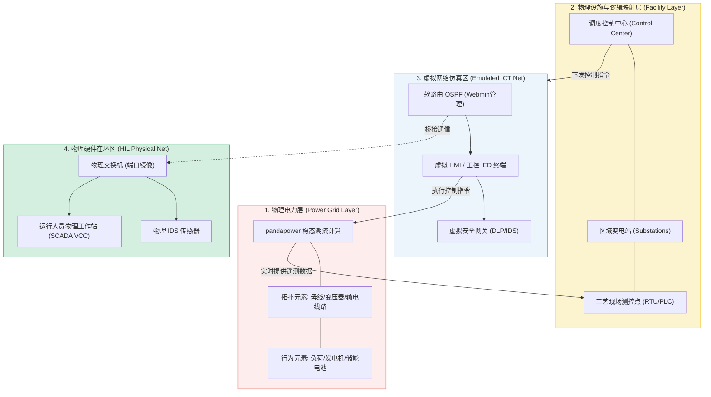

# PowerRange 电力网络安全靶场与仿真验证技术：深度精读

**文献来源**：L. Bader, E. Wagner, M. Serror. *PowerRange: An Immersive Cyber Range for Power Grid Operators.* (顶级工控网络安全与共仿真学术论文)  
**本地关联**：`05_正式资料原文/01_原始文献/03_学术论文/电力物理保全.pdf`  
**学习重心**：深度解构基于 Wattson 与 pandapower 的“网络-物理”电力监控系统共仿真（Co-Simulation）架构，掌握硬件在环（HIL）的集成设计和自动化场景派生工具 PowerOwl 的 Multi-Layer Graph（MLG）建模机理，学习如何通过高沉浸式靶场定量验证敏感数据外泄自动化响应的有效性。

---

## 一、 PowerRange 三层共仿真技术架构

为了克服传统 IT 靶场无法准确表现电网物理约束的局限，PowerRange 扩展了开源共仿真平台 Wattson，构建了集**电力稳态计算**、**Layer 2 行为重现网络仿真**与**物理硬件在环**于一体的浸入式电力网络安全靶场。



### 1. 物理电力层 (Power Grid Layer)
*   **计算内核**：采用 Python 编写的开源电力稳态潮流计算库 **pandapower**。与复杂的暂态（Transient）电磁计算相比，稳态计算能够实时响应网络仿真中的各种快速开关状态变动，兼顾高吞吐与物理真实性。
*   **物理对象建模**：在多端母线（Busbar）、发电机（Generators）和负荷（Loads）中定义基于百分比的输出控制，实时反映变电站跳闸对电网整体频率、电压和网损的真实物理冲击。

### 2. 虚拟网络仿真区 (Emulated ICT Net)
*   **原生仿真重构**：PowerRange 彻底摒弃了不稳定的 Containernet 容器网络，重构了 Wattson 底层的原生虚拟网络架构。它深度融合了 Linux network namespaces、轻量级 Docker 容器和全虚拟化虚拟机（VMs），在单个高性能硬件服务器上提供上百个独立 IP 的工控网段。
*   **Layer 2 行为重现**：网络底层直接仿真到数据链路层（OSI 第 2 层）。通过流量整形（Traffic Shaping），能够以极高的精度复现网络链路中的**丢包、带宽受限、抖动和延时**等网络环境恶化特征，为网络取证和防御动作提供真实的背景噪音。

3. **物理硬件在环 (Hardware-in-the-loop, HIL)**
   由于仿真层下沉至 Layer 2，靶场允许在无需任何驱动或中转转换的前提下，**将物理工控交换机、WiFi 接入点以及物理调试电脑直接桥接进入虚拟网络**。在保护演练人员不接触实际危险的同时，为物理攻击设备和真实恶意固件提供无差别的硬件连接环境。

---

## 二、 自动化场景派生工具 PowerOwl 与多层图 (MLG) 建模

电力网拓扑结构动辄成百上千节点，人工配置其对应的网络寻址、数据点映射以及物理位置，极其繁重。PowerRange 研发了 **PowerOwl 引擎**，实现从一个 pandapower 稳态模型到完整的、立即可运行靶场场景的**一键自动化转换**。

### 多层图 (Multi-Layer Graph, MLG) 一键派生逻辑
PowerOwl 通过建立多层图模型（MLG），将原本孤立的物理和网络数据结构绑定：

1.  **电力系统图（Power Grid Graph）**：以母线（Busbars）、负荷（Loads）、发电机（Generators）为节点，以输电线路和变压器为物理边。
2.  **物理设施图（Facilities Graph）**：将电力元素划归不同的物理边界（如变电站 Substation、厂区、中控室），作为逻辑实体。
3.  **ICT 通信图（ICT Graph）**：自动为每个 Facilities 分配对应的 PLC、RTU 以及站内 HMI；根据物理设施之间的线路连接，**自动计算并分配 IP 地址网段、生成 OSPF 路由，并一键渲染生成 IEC 104 通信数据点表（Data Point Map）**。

---

## 三、 面向自动化响应有效性评估的“攻击场景模块库”

在 PowerRange 中，验证防御技术（如数据防泄露、SOAR 自动拦截）的“有效性（Effectiveness）”不是基于理论推演，而是**通过加载模块化攻击场景库，进行实战红蓝对抗检验**：

```text
========================================================================================================
攻击阶段模块             技术手段与工具                        物理/网络特征表现 (靶场遥测观测)
────────────────────────────────────────────────────────────────────────────────────────────────────────
1. 主动侦察与扫描        nmap 主动端口与服务发现扫描           产生大量并行的突发扫描流量。工控 IDS 可
                        (Reconnaissance)                      检测到针对 104、RDP 端口的探针报文。
────────────────────────────────────────────────────────────────────────────────────────────────────────
2. 漏洞渗透与横向移动    SSH 暴力破解与已知服务溢出。           EDR 日志中触发高频鉴权失败告警。
                        (Lateral Movement)
────────────────────────────────────────────────────────────────────────────────────────────────────────
3. 过程破坏与指令注入    自定义 Python 脚本，完全封装 TCP &     SCADA 人机界面（VCC 画面）上的断路器
                        IEC 104 状态机，模拟 Industroyer      绿灯闪烁并跳闸，电网在 pandapower 仿真
                        协议，下发恶意分闸控制指令。           中瞬间表现为局部变电站失压。
────────────────────────────────────────────────────────────────────────────────────────────────────────
4. 虚假数据注入攻击      中间人攻击 (MitM) 拦截站控流量，      操作员在 VCC 大屏上看到稳定的电压/电流
                        通过 scapy 改写遥测上报，实行         正常数据（被欺骗），但物理电网在后台已
                        Telemetry 篡改 (FDI)。                 发生过载和物理发热损坏。
========================================================================================================
```

---

## 四、 本文献对本项目的直接支撑价值（元资料萃取）

PowerRange 为我们撰写《自动化响应有效性分析报告》提供了无可替代的**科学评估模型与验证方案**：

1.  **提供了“有效性”的定量验证手段**：
    报告中关于“有效性评估”的章节，可直接引用 PowerRange 的实验方法 ── 即：**“利用 pandapower 稳态潮流对物理电网状态的改变进行毫秒级实时计算，定量分析在遭遇数据泄露和恶意控制指令下发时，SOAR 采取的限速、微隔离策略对维持电网电压、损耗和频率稳定的直接物理贡献。”**
2.  **提供了对“虚假数据注入（FDI）”等高级泄露攻击的检测逻辑**：
    PowerRange 展现了黑客如何利用 Scapy 建立 IEC 104 状态机实施 MitM。这为我们提供了方案论证：单纯在边界看包是不够的，必须利用态势感知结合**“状态估计（State Estimation, SE）”**对物理遥测进行状态吻合度校验，方能戳破黑客的数据篡改，触发精准防御。
