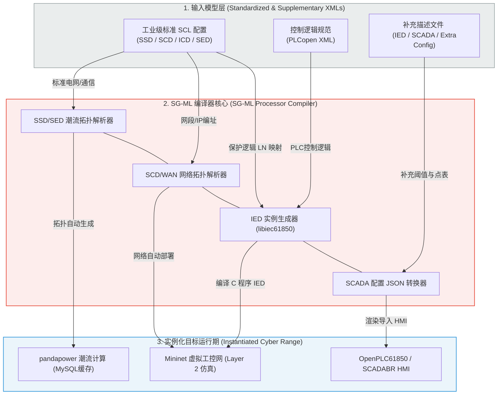

# SG-ML 智能电网一键变靶场（自动编译生成）技术：深度精读

**文献来源**：D. Mashima, M. Roomi, B. Ng, Z. Kalbarczyk, et al. *Towards Automated Generation of Smart Grid Cyber Range for Cybersecurity Experiments and Training.* (ADSC & NUS 顶尖工控靶场自动化编译器学术论文)  
**本地关联**：`05_正式资料原文/01_原始文献/03_学术论文/电网一键变靶场.pdf`  
**学习重心**：理解如何利用 XML 建模语言 **SG-ML**，回收电网资产中已有的国际标准配置（IEC 61850 SCL 与 IEC 61131-3 PLCopen），通过 **SG-ML Processor 编译器**一键自动派生出等比例的“数字孪生”安全靶场；掌握该技术如何为“敏感数据泄露与自动化响应验证”提供零工程成本的实验沙箱。

---

## 一、 SG-ML 靶场自动编译器设计架构

传统的智能电网靶场建设严重依赖安全、电力和系统工程的多领域专家，进行高成本的人工拓扑与协议适配。SG-ML（Smart Grid Modelling Language）核心思想是：**“像编译器一样，将标准电网描述文件，一键编译为立即可运行的网络-物理安全靶场运行期（Runtime）”**。

### 1. 标准化资产回收输入 (Industrial Asset Recycling)
SG-ML 直接利用电网调度中现成的描述文件作为编译输入，极具工业实用价值：
*   **IEC 61850 SCL (变电站配置描述语言)**：
    *   **SSD**：提供变电站内一次主接线图（Single Line Diagram）、电压等级和物理连接关系。
    *   **SCD**：提供整站通信配置、IED 寻址（IP/MAC 地址）及设备间发布/订阅关系。
    *   **ICD**：定义了 IED 设备的逻辑节点（Logical Nodes, LNs）和数据类型。
    *   **SED**：定义了跨变电站之间的广域网（WAN）通信拓扑与电气联络。
*   **IEC 61131-3 PLCopen XML**：以 XML 形式表达的 PLC 控制逻辑与变量分配（如梯形图、结构化文本逻辑）。

### 2. 补充描述描述模式 (Filling the Gaps)
由于工业标准文件不包含动态负荷和安全阈值，SG-ML 引入了三个轻量级补充 XML：
*   **Power System Extra Config XML**：配置动态负荷曲线（Load Profiles）与预设扰动场景。
*   **IED Config XML**：配置保护动作阈值（PTOC/PTOV 等）以及测控命名空间对齐关系。
*   **SCADA Config XML**：配置 SCADA 人机交互图和测控数据源。

---

## 二、 靶场运行期核心组件与实时交互缓存 (MySQL)

SG-ML Processor 编译器输出的靶场运行期组件，全部采用开源、高性能的工业级虚拟化工具链构建：

1.  **物理潮流模拟层 ── pandapower & MySQL 实时缓存**：
    *   将 SSD 拓扑直接翻译成 **pandapower** 网元模型。
    *   为了实现毫秒级（100ms 间隔）的“网络-物理”双向耦合，SG-ML 设计了一个**轻量级 MySQL 数据库作为中间通信“缓存（Cache）”**。
    *   虚拟 IED 读取 MySQL 缓存中的最新潮流遥测值（通过 MMS 协议发给 SCADA），或者将来自 PLC 的“合分闸遥控指令”改写进数据库，直接触发 pandapower 潮流计算更新。
2.  **网络行为仿真层 ── Mininet & libiec61850 虚拟终端**：
    *   读取 SCD 文件的网络接口参数，在 **Mininet** 中一键渲染生成数据链路层（Layer 2）工控网络。
    *   在 Mininet 虚拟节点上，用 C 语言底座（基于开源 **libiec61850** 库）自动化编译出等比例的虚拟 IED。这些终端能够跑真实的 MMS（站控监视）、GOOSE/R-GOOSE（变电站快速对等状态交换）和 R-SV（电压电流采样值）通信。
3.  **自动控制与 HMI 层 ── OpenPLC61850 & SCADABR**：
    *   自动启动 **OpenPLC61850**，挂载 PLCopen 逻辑运行。
    *   自动解析 SCADA XML 转换为标准的 JSON 点表，导入 **SCADABR** 自动生成监控大屏。

---

## 三、 基于编译靶场的两类电力敏感数据泄露与攻击仿真

SG-ML 编译生成的数字孪生靶场，可以完美复现、模拟电力系统特有的高级持续威胁（APT）和数据篡改：

*   **1. 虚假指令注入攻击 (False Command Injection, FCI)**：
    黑客进入工控 Mininet 虚拟网后，运行基于 `libiec61850` 编写的 `IEC61850bean` 客户端，下发非法的 MMS 控制报文（如 Open Circuit Breaker）。虚拟 IED 接收报文、执行并将分闸状态写入 MySQL 缓存，pandapower 在 100ms 内重算潮流，SCADABR 大屏瞬间亮起失压跳闸警报告警。
*   **2. 中间人遥测数据篡改攻击 (Man-in-the-Middle, MitM)**：
    黑客通过 `arpspoof` 在站控交换机实施 ARP 欺骗，拦截虚拟 IED 与 SCADABR/OpenPLC 之间的通信流量。
    黑客可进行两类数据危害：
    *   **敏感数据泄露（Exfiltration）**：嗅探并提取特高压输电线路的实时潮流极限、功率因数和保护参数。
    *   **假数据注入（FDI）**：阻断真实的 PTOC 过流保护跳闸 MMS 报文（Alarm Suppression），并向 SCADA 持续灌入正常的电压伪造数据，欺骗调度员，导致物理电网在后台发生实质性的过载烧毁（AURORA 攻击复现）。

---

## 四、 本文献对本项目的直接支撑价值（元资料萃取）

1.  **提供了零工程门槛的“有效性自动化演练沙箱”**：
    本项目的《实施方案资料集》可直接引用 SG-ML 架构：**“为了验证数据防泄露与响应控制技术在各个厂站的部署有效性，方案设计引入 SG-ML 靶场编译器。安全运维人员无需手动搭建测试床，只需直接上传本站已有的 IEC 61850 SCD/SSD 文件，即可一键自动编译出完全对应的变电站网络-物理数字孪生沙箱，在沙箱内一键注入 FDI 攻击，定量评测响应策略的拦截概率和阻断延时。”**
2.  **验证了多变电站协同防护的“低配置开销”可行性**：
    论文给出了详实的性能数据：在一台普通 Core i9 桌面电脑上，可同时运行 **5 个完整虚拟变电站、104 个虚拟 C 程序 IED 的等比例全协议仿真，计算步长低至 100ms**。这有力论证了我们在报告中提出的“基于低成本虚拟沙箱验证自动化响应有效性”方案的极高产业可行性与轻量化部署优势。
