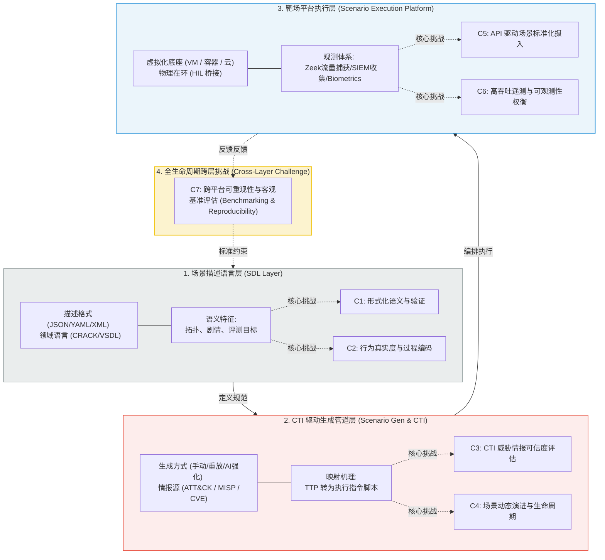

# CyRaTrEx 通用网络安全靶场与评估大纲：深度精读

**文献来源**：A. Garg, A. Boualouache, A. Imeri, U. Roth. *A Survey of Cyber Range Training Exercise Scenario Description, Generation, and Execution.* (卢森堡科学技术研究院 LIST, 2025年最新靶场全景系统评述)  
**本地关联**：`05_正式资料原文/01_原始文献/03_学术论文/通用靶场大纲.pdf`  
**学习重心**：全面掌握现代网络安全靶场演练（CyRaTrEx）的 **“描述 ➔ 生成 ➔ 执行” 三层顶层体系架构**；深度学习大纲推荐的靶场遥测（Telemetry）、可观测性（Observability）与评估指标（Metrics）设计规范；解构制约靶场发展的 7 大核心挑战，为本项目《有效性分析报告》构建学术级的“自动化响应客观评估与定量打分基准”。

---

## 一、 CyRaTrEx 三层体系架构与七大挑战映射图

本评述通过系统分析 2010-2025 年间 107 篇核心靶场学术成果，提出了将网络安全靶场演练生命周期划分为三个互联层级的统一分类法（Taxonomy），并精准定位了制约各层发展的 7 个核心挑战（C1 - C7）：

---

## 二、 靶场演练（CyRaTrEx）三层架构深读

### 1. 场景描述语言层 (Scenario Description Languages, SDLs)
定义场景的“WHO（谁攻击）、WHAT（何种漏洞）、WHEN（剧情时序）与 WHERE（哪个子网）”的机读规范。
*   **通用序列化格式**：JSON、YAML、XML 等。常用于声明式定义静态基础设施。由于缺乏语义表达，无法直接描述动态攻防对抗叙事和学习成效评估。
*   **专用领域语言 (Domain-Specific SDLs)**：
    *   **CRACK SDL**（欧盟 SPARTA 项目）：基于 YAML 扩展了 OASIS 国际标准 TOSCA。能够描述计算节点、网络、漏洞、红蓝团队及通关目标，并在部署前通过 Datalog 进行逻辑一致性冲突校验。
    *   **VSDL**：基于约束逻辑语义，允许使用 SMT 求解器自动将高抽象级的安全需求（如“一个存在提权漏洞的域控制器网络”）实例化为具体的底层 VM 拓扑。
    *   **CST-SDL**：基于图模型专门定义多学员协同演练，内建角色关系、关卡目标和通关解法路径分支。

### 2. CTI 驱动生成管道层 (Scenario Generation & CTI Pipelines)
将外部威胁情报转化为靶场可执行脚本的技术：
*   **手动设计 (Manual)**：人工手写 YAML 模板或配置（如 KYPO 靶场），控制度高但极度耗时，无法快速适应零日漏洞威胁。
*   **重放设计 (Replay-Based)**：通过重放真实事件中捕获的 PCAP 报文、终端日志。**真实度极高，但缺乏交互性**（黑客攻击动作不会因为防守方的拦截动作而自适应改变）。
*   **AI/ML 驱动 (AI-Driven)**：利用强化学习（如微软 CyberBattleSim 智能体）或者大语言模型（LLM）充当虚拟红队，在 Mininet 仿真内自适应寻路渗透。

### 3. 场景执行平台层 (Scenario Execution Platforms)
靶场的物理/虚拟化底层（如 OpenStack、Docker、Terraform、Ansible、Kubernetes）。负责场景自动化编排部署、攻击载荷动态注入，以及对演练全程的监控、测量和自动化评分。

---

## 三、 演练客观度量、遥测与可观测性大纲（Metrics & Telemetry）

文献对现代靶场如何度量、量化安全演练成效给出了科学、详实的技术指标与监测架构：

### 1. 靶场多维遥测数据源 (Telemetry Infrastructure)
为了还原真实的防守态势，执行平台必须静默部署高频遥测管道，严禁干扰业务运行：
*   **网络遥测 (Network Telemetry)**：利用 Zeek（原 Bro）、Suricata 等深度报文分析器收集全流量 PCAP、连接时长与异常工控通信报文。
*   **主机遥测 (Host Telemetry)**：采集虚拟机/容器内的系统审计日志（Syslog、Windows Event Log、Auditd）与 EDR 文件访问事件流。
*   **行为遥测 (Trainee Telemetry)**：收集学员/防守方自动响应脚本的终端操作命令序列（Bash history、PowerShell 记录），甚至采集生理指标（如 SCORPION 靶场收集心率以评估抗压应激反应）。

### 2. 安全响应“有效性”定量评估指标大纲 (Metrics Specification)
大纲提炼了评估防御策略及自动化响应技术的 4 大黄金度量指标，**直接作为我们项目《分析报告》定量评估的理论大图纸**：

$$Effective\_Score = f(\text{Detection\_Time}, \text{Containment\_Time}, \text{Asset\_Impact}, \text{False\_Alarm})$$

*   **指标 1：检出时延（Detection Time / Speed）**：
    从敏感数据外泄行为发生，到态势感知系统（SIEM/DLP）成功识别、并上报威胁告警的绝对时间差。
*   **指标 2：遏制时延（Containment / Resolution Speed）**：
    从威胁告警触发，到 SOAR 自动编排执行微隔离、阻断或流量整形，**使数据泄露速率降至零的安全自愈执行延时**。
*   **指标 3：物理资产冲击度（Asset Physical Impact）**：
    在发生攻击和自动阻断过程中，对电网一次侧设备（电压偏差、频率波动、变电站跳闸发热损耗）及二次侧监控可用性的冲击率。
*   **指标 4：误报与响应损耗比（Collateral Cost Rate）**：
    由于防御动作（如微隔离、挂起用户）导致的电力业务非预期中断时间与正常生产损耗。

---

## 四、 本文献对本项目的直接支撑价值（元资料萃取）

1.  **为《分析报告》提供了“客观评估指标体系（C7 Benchmarking）”**：
    报告中关于“有效性量化打分”的论证，可以直接引用本项目整理出的 **“CyRaTrEx 遥测度量大纲”**。通过检出时延（Detection Speed）、遏制时延（Containment Speed）和物理侧电网平稳率（Asset Impact）三大指标构建三维评估坐标轴，让报告展现出绝对扎实的学术理论支撑。
2.  **为《实施方案》提供了“DevOps 式持续生命周期演进（C4 Evolution）”的可行路线**：
    敏感数据泄露相应技术不能是静态部署的。方案可引用 C4 挑战的破局手段——**采用 DevOps 理念，实现“CTI（如国家电网 MISP 情报共享平台） ➔ 自动化 SDL 编译（如 SG-ML） ➔ 靶场沙箱验证 ➔ 自动部署生产 DLP 策略”的 CI/CD 自动化持续安全演进闭环**。
