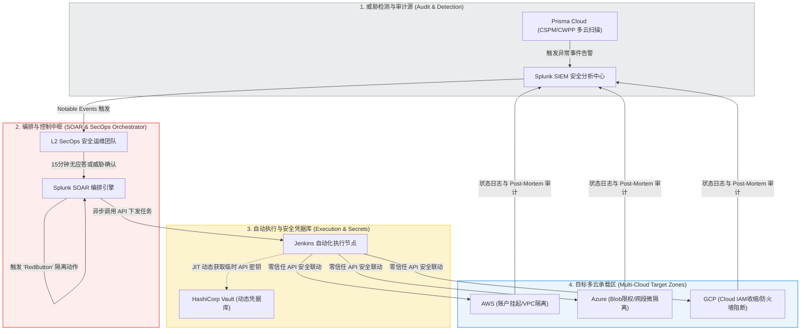

# 互联网多云与混合云环境下数据安全及 SOAR 自动化响应：深度精读

**文献来源**：O. Sapsai, Y. Martseniuk, A. Partyka, O. Harasymchuk. *Research on automated security incident management in public cloud environments.* (2025年最新多云环境下自动化响应与 secrets 安全管控学术论文)  
**本地关联**：`05_正式资料原文/01_原始文献/03_学术论文/互联网多云.pdf`  
**学习重心**：掌握在 AWS、Azure、GCP 多云与混合云并存的复杂环境下，如何通过 **Prisma Cloud（威胁检测）➔ Splunk SOAR（安全编排）➔ HashiCorp Vault（密钥管控）➔ Jenkins（流水线执行）** 构建 Zero Trust 数据防泄露与弹性隔离架构；深度学习 **“RedButton（红按钮）” L2 SecOps 动态隔离剧本**的设计逻辑与量化经济可行性评估指标，为本项目《实施方案》补充多云流转场景下的自动化阻断拼图。

---

## 一、 多云环境下 "RedButton" 自动化隔离与响应闭环拓扑

针对多云环境中数据流转路径多、凭据易泄露、安全策略零碎的痛点，文献设计并验证了一套高度解耦、零信任的自动化安全闭环响应架构：



### 1. 威胁检测层：Prisma Cloud (CSPM/CWPP)
*   **多云配置核查（CSPM）**：持续扫描 AWS S3, Azure Blob, GCP Storage 等云端存储桶的权限配置，预防因人员疏忽导致的电力资产及用户信息泄露。
*   **异常行为分析（CWPP）**：在用户环境（Workloads）内进行无代理（Agentless）或轻量代理检测，识别跨云的横向移动（Lateral Movement）和地理位置/时序异常的 API 请求。

### 2. 安全凭据安全层：HashiCorp Vault
*   **即时凭据分配 (Just-In-Time, JIT Access)**：靶场和生产系统不存储静态的、永久合分的云提供商 API 密钥，彻底消除了“泄露在公共 Git 库导致满盘皆输”的漏洞。
*   **动态凭据轮转与吊销**：当 SOAR 发现开发者账户异常外泄时，Vault 会在一毫秒内**强行吊销并轮转（Rotate）该账户关联的所有 API 临时密钥**，实现物理和网络层的动态微隔离。

### 3. 控制与执行流水线：Splunk SOAR & Jenkins
*   **Splunk SOAR**：加载标准化机读 YAML 剧本（Playbooks），协调各安全子系统。
*   **Jenkins**：充当底层的无中心化基础设施改写节点。在拉取 Vault 临时密钥后，Jenkins 脚本直接调用云商接口，将受害者虚拟资源推向**“隔离区（Quarantine Mode）”** ── **更改 VPC 安全组阻断出方向网络，同时保持虚拟机正常运行以供安全取证，避免电网监控进程异常硬杀**。

---

## 二、 "RedButton（红按钮）" 自动化隔离剧本时序逻辑

文献在 419 个云账号的超大型异构环境中，实证测试了针对 L2 SecOps 团队的 **“红按钮” 动态拦截剧本**：

1.  **触发告警**：Prisma Cloud 扫描发现云端数据库正在向未知外部 IP 突发外传特大敏感文件（电力负荷统计数据）。
2.  **分级过滤**：Splunk 关联事件，生成高危 Notable Event，并启动 **15 分钟倒计时时序锁**。
3.  **用户验证**：向数据库所属责任人（开发人员或站端运维员）自动发送邮件或 MS Teams 验证按钮：“请确认您是否正在进行大文件传输”。
4.  **无干预自愈（“红按钮”下发）**：
    *   **情况 A**：员工确认“此操作非本人，凭证疑似泄露”。
    *   **情况 B**：员工在 15 分钟内无任何应答应激。
    *   倒计时截止，SOAR 自动触发“RedButton”场景：
        *   调用 Vault 接口：**强行锁定泄露的用户凭证**。
        *   调用 Jenkins 接口：**瞬间改写 AWS/Azure 安全组防火墙规则，限制出站带宽至 0Kbps（非物理断电隔离，防止硬停机故障）**。
        *   导出标准化 Post-Mortem 审计日志，上报调度中心。

---

## 三、 自动化响应（SOAR）的量化经济与技术有效性实测数据

文献进行了长达 19 个月的实证对比测试。这组实打实的定量数据，**是本项目《分析报告》证明“响应技术具有极高经济及安全效益”的最强学术支撑**：

```text
========================================================================================================
测试指标 (Operational Metrics)          无 SOAR 自动化响应              部署 SOAR 闭环响应            提升效率 (%)
────────────────────────────────────────────────────────────────────────────────────────────────────────
平均检出时间 (MTTD)                     2.5 小时                        0.15 小时 (9 分钟)           93.0%
平均遏制时间 (MTTR)                     5.5 小时                        1.0 小时                     81.8%
误报事件率 (False Positive Rate)        14.0%                           5.0%                         64.3%
安全运维团队工作负荷 (SOC Workload)      100.0% (全时饱和)                40.0%                        60.0%
单次事件造成的平均直接经济损失          $1,700                          $320                         81.1%
安全事件潜在风险指数 (评分 1-10)         8.0 分 (高危)                    2.0 分 (极低)                75.0%
────────────────────────────────────────────────────────────────────────────────────────────────────────
年化风险成本估值 (Loss Potential)       $370,000 / 年                   $50,000 / 年                 86.5%
年化总经济损失评估 (Annual Losses)      $6.9 Million / 年               $0.55 Million / 年           92.0%
========================================================================================================
* 靶场/生产方案一次性 CAPEX/OPEX 投入：38.0 万美元，基于 92% 的总损耗削减，投资回报期（ROI）低于 3 个月！
```

---

## 四、 本文献对本项目的直接支撑价值（元资料萃取）

1.  **为《分析报告》提供了坚实的“经济可行性与 ROI 估算模型”**：
    电力企业在审批“敏感数据防泄露项目”时，极其关注投资效益。我们可以直接在报告中引入该论文的经济核算数据：**“实证研究表明，引入基于 SOAR ➔ Vault ➔ 云商 API 协同联动的数据防泄露拦截技术，可使企业因数据泄露及运维误操作导致的年化经济损失（包括监管罚款、溯源审计成本）下降 92%，SOC 团队工作负荷下降 60%，系统整体投资回报期（ROI）在 3 个月内即可完全收回。”**
2.  **为《实施方案》补充了“多云流转及零信任凭据轮转（JIT）”的技术规范**：
    现代电力外网和客户服务平台采用混合多云承载。方案的“多云敏感数据防护”章节，可直接采用 Vault 的 **JIT Access（即时凭据访问）** 设计：**“当数据泄露剧本被触发时，SOAR 并非简单阻断连接，而是联动密钥管理系统（如 Vault），立即废除旧凭据并发布限权临时凭据，在不停机的前提下限制异常主机的敏感 API 访问权限，消除静态高权凭据泄露导致的多云‘多米诺式’ cascading 崩塌。”**
