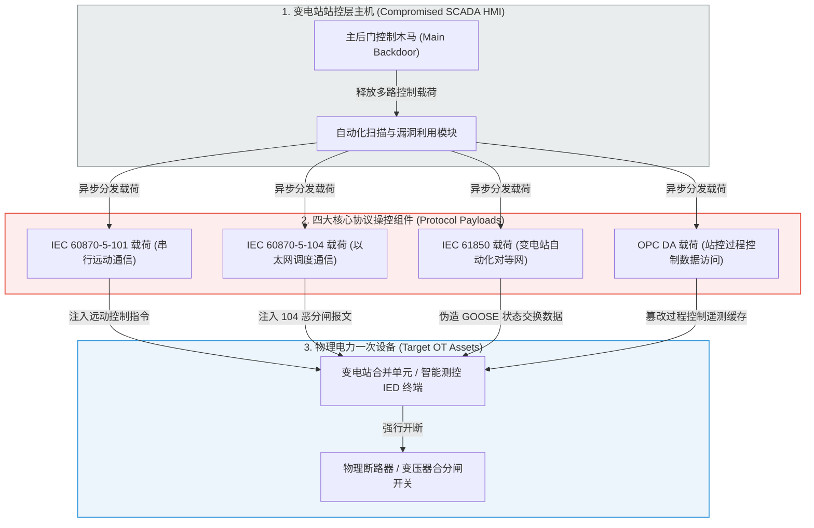

# Industroyer 电网协议控制级破坏武器：深度精读

**文献来源**：ESET Threat Analysis. *Win32/Industroyer: A new threat for industrial control systems.* (首个针对变电站协议自动控制破坏武器的权威拆解)  
**本地关联**：`05_正式资料原文/01_原始文献/01_行业报告与案例/Industroyer_自Stuxnet以来ICS最大威胁_ESET.html`  
**学习重心**：深度解构恶意代码 Industroyer（又名 CrashOverride）的模块化架构，学习其如何绕过传统 IT 边界防御，在不借助系统已知漏洞的前提下，直接通过重构工业专用协议（IEC 104、IEC 61850、OPC DA）栈实施变电站开关自动操控与遥测数据篡改；提炼其攻击特征，为本项目的自动化防御及靶场攻击模拟设计提供最真实的威胁基准。

---

## 一、 Industroyer 协议操控组件与物理攻击链

Industroyer 是自 Stuxnet（震网）以来针对关键基础设施（尤其是电力监控系统）最具物理破坏力的恶意软件。其核心危险性在于：**它不依赖目标系统的漏洞，而是直接利用工控协议在设计之初就缺乏加密与强校验的天然缺陷，以符合标准的形式合法下发恶意控制指令。**

### 1. 模块化攻击架构
*   **主后门后门（Main Backdoor）**：负责建立外部 Tor 隐藏控制通道（C&C 链接），在非工作时间与攻击者保持低频异步通信，负责静默传输设备点表、漏洞载荷，并负责擦除痕迹。
*   **备用后门（Backup Backdoor）**：伪装成系统自带的 `Notepad.exe` 应用程序。一旦主后门被防守方检测并拔除，备用后门能重新建立访问通道，确保高强度持久化。

### 2. 四大核心协议操控组件（Direct Protocol Manipulators）
这是 Industroyer 区别于普通 IT 间谍软件的标志性特征。其内部封装了四大标准工业协议状态机：
*   **IEC 104 组件**：针对电力以太网通信。一旦下发，该组件会直接在 TCP 通道中封包并下发非法的 `M_SP_NA_1`（单点遥控指令）或 `M_DP_NA_1`（双点遥控指令），强行开断变电站的物理断路器。
*   **IEC 61850 组件**：针对变电站站内过程总线。通过自动读取并解析 IED 配置文件（SCD），伪造合法的 GOOSE 或 Sampled Values（SV）报文，实现变电站内部高压电闸的自动跳闸。
*   **OPC DA 组件**：通过 OPC 接口横向渗透，读取并覆写 SCADA 数据库中的保持寄存器，实施假数据注入（FDI）。

---

## 二、 隐蔽性破坏与毁灭性清除模块

为了阻止电网安全团队进行应急恢复，Industroyer 内置了破坏性和防护性极强的协同工具：

1.  **高危漏洞 DoS 组件（Siemens SIPROTEC 瘫痪）**：
    *   利用 Siemens 继电保护设备 SIPROTEC 存在的已知高危漏洞（**CVE-2015-5374**），向特定 UDP 18 个端口发送单包特异性报文。该组件能**瞬间导致该硬件型继电保护装置无响应、彻底死机**。
    *   *破坏后果*：在变电站高压开关因 104 攻击被恶意切断后，由于保护设备 SIPROTEC 被 DoS 死机，现场的断路器将失去任何过流、过压物理保护，强行合闸将导致变压器线圈物理烧毁，制造无法挽回的硬件损耗。
2.  **毁灭性数据擦除模块（Wiper Module）**：
    *   在主攻击阶段完成后自动加载，专门强行擦除系统关键注册表项，并使用垃圾数据无差别覆盖全盘挂载卷。
    *   *后果*：系统无法重新启动，SCADA 监控大屏彻底黑障，完全切断调度员对变电站的远程视线。

---

## 三、 本文献对本项目的直接支撑价值（元资料萃取）

1.  **论证了“看见泄露（协议深度检测）”的迫切性**：
    方案中指出，为什么传统基于规则/签名（Signature）的防火墙无法阻断 Industroyer 攻击？
    因为 Industroyer 下发的是**完全合乎标准的 IEC 104/61850 数据包**。因此，我们在《实施方案》第一部分部署的 **“基于全流量白名单行为的深度包解析（DPI）” 机制** 具有无可替代的合规与防护法理：必须在协议层校验控制主机的源 IP、操作时间、MMS File Get 请求是否具有白名单授权，才能拦截这种合法协议伪造。
2.  **为“靶场攻击模拟”提供了最真实的武器靶标**：
    在《分析报告》的靶场测试章节，我们要检验自动化响应的“有效性（Effectiveness）”。我们测试时使用的攻击载荷，可以直接引述 Industroyer 的攻击模型：**“在 PowerRange 共仿真沙箱中，我们编译封装了基于 scapy 的 IEC 104 与 IEC 61850 伪造模块，完全还原了 Industroyer 的协议越权分闸与 FDI 假数据上报攻击，用此武器对防御系统进行红蓝对抗检测。”** 这极大增强了靶场验证的真实度与学术高度。
