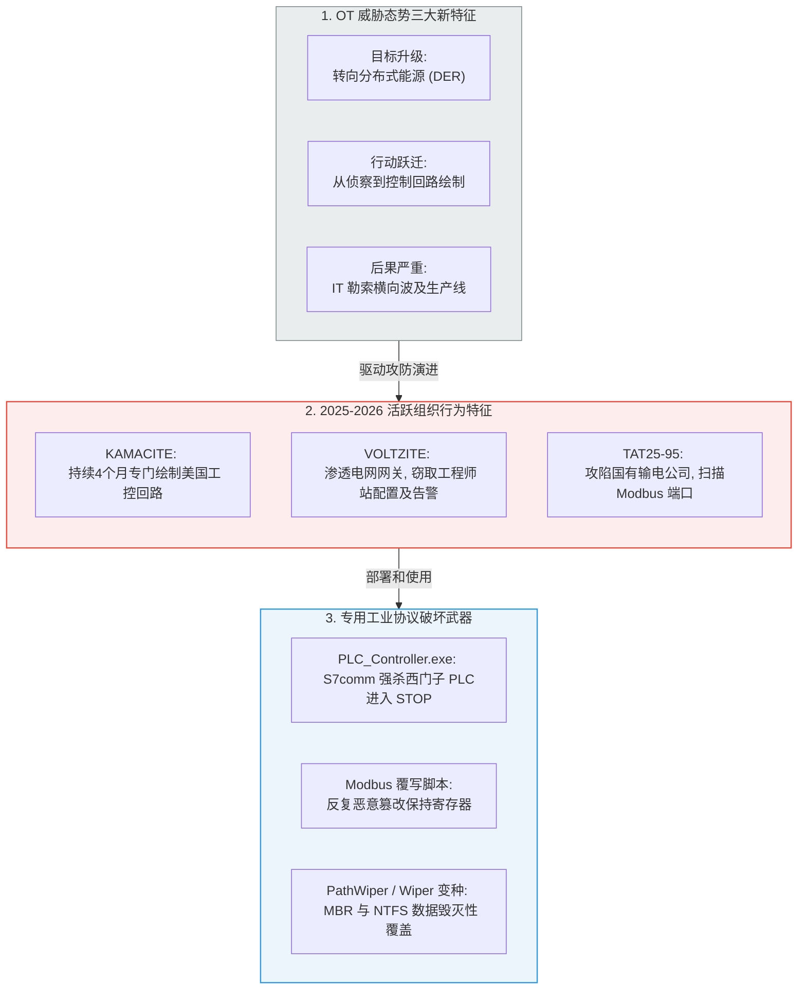

# Dragos 2026 年 OT 网络安全年度回顾：深度精读

**文献来源**：Dragos Threat Intelligence. *2026 OT Cybersecurity Year in Review.* (工业及电力控制安全领域第 9 届全球公认权威年度报告)  
**本地关联**：`05_正式资料原文/01_原始文献/01_行业报告与案例/Dragos_2026年OT网络安全年度回顾报告.html`  
**学习重心**：深度提炼 2025-2026 年度全球关键基础设施（电网、能源、水务）面临的最前沿威胁情报（CTI）；掌握威胁行为者如何超越初始入网（Prepositioning）阶段，实施**主动理解、绘制工控回路拓扑（Control Loop Mapping）与操纵物理过程**的演进趋势；学习最新的 OT 行业安全标准与监管规范（特别是 NERC CIP-015-1 东向流量监测），为本项目的风险评估与方案合规设计提供最新、最高密度的实测依据。

---

## 一、 2025-2026 年 OT 级数据泄露与攻击演进图谱

Dragos 第 9 届年报明确指出，工控系统的安全风险已经发生颠覆性漂移：**攻击者不再局限于入侵网络后“潜伏静止”，而是积极开始在 OT 生产网络内横向移动、滥用工业协议扫描，以绘制控制回路拓扑、窃取核心配置数据。**

---

## 二、 全球电网与分布式能源面临的极高风险事件（2025年典型）

报告披露了多起 2025 年记录在案的、针对电网资产和分布式能源（DER）的重大网络攻击及配置数据泄露案例：

1.  **巴基斯坦输电网 SCADA 配置数据外泄事件（2025年7月）**：
    *   **案情**：攻击者（TAT25-95）攻陷了一家国有输电公司，在网内频繁发起 **Modbus 端口扫描**，疯狂搜寻 SCADA 漏洞利用工具，并**强行打包下载了约 100 份包含电网运行参数和配置文件的数据包**。这是最典型的“工控数据防泄露自动化响应失能”案例。
2.  **分布式能源（DER）首次遭受重大网络攻击（2025年12月）**：
    *   **案情**：针对波兰联合热电（CHP）设施和**可再生能源管理系统（包括风电、太阳能分布式并网控制系统）**发起了一次高度协调性的破坏活动，造成大范围通信中断。
    *   *启示*：由于新能源、分布式电源大量接入电网外网，DER 系统正成为电网最脆弱的“新型高危攻击面”，跨云、跨边界的安全保护迫在眉睫。

---

## 三、 NERC CIP-015-1 强制性内部网络安全监测标准深度解读

这是报告在政策合规领域给出的最关键更新。2025年6月，美国联邦能源监管委员会（FERC）批准了 **NERC CIP-015-1（内部网络安全监测）** 标准，该标准于 **2025年9月2日** 正式生效：

*   **合规新要求**：首次强制要求对可信的 OT 区域（如安全区 I/II 核心网段）实施**持续的东西向内部网络监测（Internal Network Security Monitoring, INSM）**。
*   **技术指向**：不再满足于“边界安检”。所有电力运营商必须具备检测工控网内侧异常流量、未经授权的 PLC 跨网段通信以及设备内部侧横向移动的能力。
*   **对本项目的意义**：这为我们《实施方案》第一部分（看见泄露）及第三部分（温柔拦截时的微隔离）提供了**最新、最坚实的强制性国际标准支撑** ── *对东西向流量实施白名单深度检测与微隔离自动响应，是完全对标 NERC CIP-015-1 和欧盟 NIS2 指令的必选动作。*

---

## 四、 本文献对本项目的直接支撑价值（元资料萃取）

1.  **论证了“数据防泄露（DLP）”在电力 OT 网内部的极端迫切性**：
    传统的电网防泄漏多放在 IT 办公网。Dragos 报告用血淋淋的数据（如 VOLTZITE 渗透 Sierra 变电站网关并横向移动至工程师站、窃取配置文件与告警数据）表明：**黑客的主要目的就是窃取并绘制 SCADA 工程师站的控制回路图、配置文件和物理拓扑参数。**
    这有力论证了我们在《实施方案》第三部分中部署 **“DLP 结合 HashiCorp Vault JIT 即时临时凭据”** 这一防护的行业前沿性与迫切度：必须对工程师站的 API 读取进行严格的 JIT 单次口令轮换，才能在毫秒级内斩断 VOLTZITE 等组织的密码外泄和横向数据窃取行为。
2.  **提供了电力行业特定防护方案合规性（NERC CIP-015-1）的国际背书**：
    在撰写《实施方案》和《分析报告》时，我们可以直接引述该最新标准：**“为了彻底落实 FERC 批准、于2025年9月2日正式生效的 NERC CIP-015-1 标准中对可信 OT 域内部网络安全监测（INSM）的强制要求，方案设计将深度解析旁路镜像探针部署于生产控制网的东西向核心链路，实时监控横向配置数据泄露行为，并触发 SOAR 剧本进行微隔离自愈。”** 这一合规高度在汇报时极具杀伤力。
