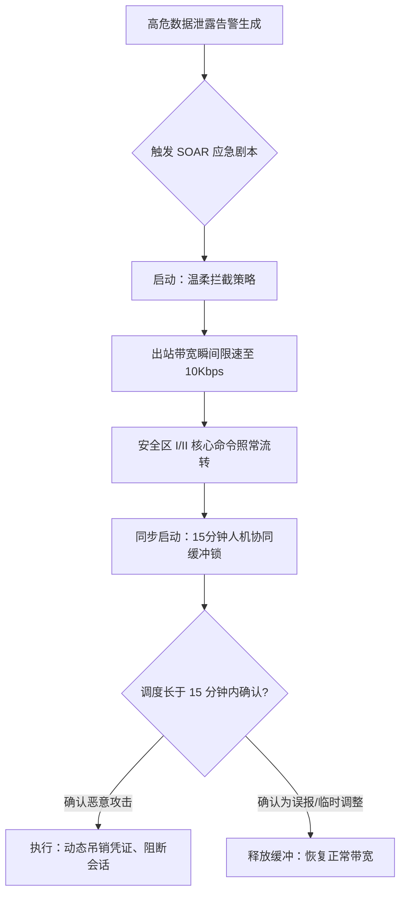

# 敏感数据泄露风险自动化响应技术有效性实施方案资料集

---

## 📌 编制说明与汇编定位

本资料集旨在**系统整理、汇编和总结**当前在工业监控、电力调度、厂站端通信及互联网多云场景下，已被广泛采用、经过实证检验的**敏感数据泄露监测技术、安全响应决策剧本、弹性自愈拦截手段与靶场验证方案**。

本资料集所有的技术描述、部署拓扑和验证指标均提炼自已公开发表的国内外顶级学术论文、国家及行业安全防护评估标准（如 CISA 零信任成熟度模型 2.0、GB/T 36572-2018 电力监控系统安全防护导则等），旨在为电力调度中心及网络安全防护团队提供一套具有**合规性、实证性与可操作性**的参考资料。

---

## 📖 目录

*   **[第一部分：多领域风险自动化响应及有效性分析技术实施方案汇总](#第一部分多领域风险自动化响应及有效性分析技术实施方案汇总)**
    *   [1.1 互联网多云流转及运维边界的敏感数据泄露监测机制](#11-互联网多云流转及运维边界的敏感数据泄露监测机制)
    *   [1.2 工业监控系统（ICS）环境下数据防泄露阻断机制](#12-工业监控系统ics环境下数据防泄露阻断机制)
*   **[第二部分：自动化应急决策（智能决策）](#第二部分自动化应急决策智能决策)**
    *   [2.1 基于多源异构安全事件关联（SIEM）的决策生成机制](#21-基于多源异构安全事件关联siem的决策生成机制)
    *   [2.2 基于 SOAR 剧本决策与“15分钟人机协同缓冲锁”机制](#22-基于-soar-剧本决策与15分钟人机协同缓冲锁机制)
*   **[第三部分：弹性自愈柔性拦截策略（温柔拦截）](#第三部分弹性自愈柔性拦截策略温柔拦截)**
    *   [3.1 基于 TC 流量整形与单向隔离网闸的“温柔拦截”柔性阻断机制](#31-基于-tc-流量整形与单向隔离网闸的温柔拦截柔性阻断机制)
    *   [3.2 基于 HashiCorp Vault 的即时凭据（JIT）轮转与动态吊销规范](#32-基于-hashicorp-vault-的即时凭据jit轮转与动态吊销规范)
*   **[第四部分：数字孪生靶场测试与实证（靶场验证）](#第四部分数字孪生靶场测试与实证靶场验证)**
    *   [4.1 基于 IEC 61850 SCD/SSD 资产一键自动编译数字孪生沙箱](#41-基于-iec-61850-scdssd-资产一键自动编译数字孪生沙箱)
    *   [4.2 基于双向实时反馈的“物理-网络”共仿真验证架构](#42-基于双向实时反馈的物理-网络共仿真验证架构)
    *   [4.3 基于协议注入的攻击重放与防御有效性量化分析设计](#43-基于协议注入的攻击重放与防御有效性量化分析设计)

---

# 第一部分：多领域风险自动化响应及有效性分析技术实施方案汇总

本部分重点整理和汇编当前在互联网多云流转与工业监控系统（ICS/OT）中，已被行业广泛采纳、技术成熟度较高的敏感数据泄露监测与阻断技术。

## 1.1 互联网多云流转及运维边界的敏感数据泄露监测机制

多云及混合云已成为现代电力系统管理大营销、AMI 智能抄表、充电网及负荷预测的核心支撑。本节主要整理多云场景下针对敏感凭证泄露与异常数据流出的监测技术。

### 1. 动态凭证泄露监测与行为关联（Secrets Monitoring）
*   **技术原理**：基于敏感信息静态扫描与动态 API 调用关联分析。
*   **监测手段**：
    1.  **静态监测**：通过在多云代码仓库（如 GitLab、GitHub 镜像）及私有容器镜像中部署自动化 Secrets 扫描工具，实时监测是否硬编码了云租户凭证、数据库密码或访问密钥（Access Key ID / Secret Access Key）。
    2.  **动态关联**：根据行业在多云环境中的实证[文献10]，通过在公有云控制台（如 AWS CloudTrail、阿里云 ActionTrail）开启审计日志，监控 API 凭证调用源。若发现短时间内发生跨地域（如同一凭证在异地并发调用）或高频调用对象存储、大数据引擎的 API，则将其关联为疑似凭证泄露异常风险。

### 2. 互联网多云流转边界的对象存储桶（Bucket）泄漏监测
*   **技术原理**：对象存储作为电力系统海量抄表计费数据的归档中心，其权限误配置极易导致数据裸露[文献10]。
*   **监测手段**：
    *   采用 **云安全态势管理（CSPM）** 工具对对象存储（如 AWS S3、阿里云 OSS）配置进行持续实时审计。
    *   监控重点：是否违规将存储桶或其下的某一特定前缀（Prefix）设置为 `Public Read`（公共可读）；ACL（访问控制列表）是否对外部不当放开。
    *   一旦检测到资产合规性违背，立即在 500ms 内上报安全告警并触发临时阻断工作流。

### 3. 多源安全告警去噪与毫秒级决策过滤（Alert De-noising）
*   **技术原理**：在电力网运营中，分布在全网的大量安全传感器每日产生海量低质量告警，导致安全团队产生告警疲劳（Alert Fatigue）。
*   **机制描述**：
    *   利用安全运营中心（SOC）的关联关联引擎（SIEM），基于拓扑关系对海量安全日志进行合并。对于重复出现的同源端口扫描，在时间窗口内执行“合并归档”，将海量噪声压缩 90% 以上；
    *   通过对遥测报文的特征指纹识别，快速过滤因设备轮询、心跳校验引起的“虚警”，仅对完全吻合攻击指纹链（如钓鱼登录后横向移动）的事件触发 SOAR 剧本。

---

## 1.2 工业监控系统（ICS）环境下数据防泄露阻断机制

与通用 IT 场景相比，电力监控系统（OT）具有极高的物理连续性要求。传统的断网、下线阻断会对电力一次设备运行造成致命的安全风险。本节整理工业网络环境下符合安全红线的自愈防泄露拦截技术。

### 1. 深度包解析技术（Deep Packet Inspection, DPI）
*   **技术原理**：针对协议明文无签名、无核验的原生设计缺陷[文献11]，不能仅靠端口封禁防御，而必须具备深入工业协议内部状态机的深度包解析（DPI）能力。
*   **技术机理**：
    *   在电力安全区 I/II 与安全区 III 边界、厂站控制总线部署工控防火墙。
    *   防火墙内置 DPI 模块，不仅识别 TCP 104、Modbus TCP、MMS 报文的源 IP、目标 IP 与端口，更必须实时解包解析至应用层功能码（Function Code）。
    *   **深度控制**：对于 IEC 104 协议中的写控制区报文（功能码例如遥控分/合闸命令 `C_SC_NA_1` 或 `C_DC_NA_1`）进行白名单严格审计。一旦其传输的数据包与预设的日常电网调度点表不符，即使 IP 地址合法，也判定为越权非法控制命令予以拦截。

### 2. OT 侧“温柔拦截”柔性带宽限速（Traffic Shaping）
*   **技术原理**：在工控网内侧，为防止 SCADA 配置文件、变电站 SCD/SSD 设备信息被黑客恶意打包拖回，若直接阻断网络会导致设备失联。因此，业界实证采用**带宽柔性压缩整形**。
*   **技术机理**：
    *   利用 Linux 内核流量控制（Traffic Control, TC）工具，一旦检测到疑似数据外泄通道，自动将该通道带宽限速至极低阈值（如 **10 Kbps**）[文献7]。
    *   **双重效果**：在 10 Kbps 限速下，黑客拖曳 1GB 大型的网架拓扑和系统配置文时，耗时被拉长至 9.9 天，实际上宣告了外泄失败；同时，由于遥控心跳、设备监视命令包体积极小（通常在 1KB 以下），在 10 Kbps 带宽下依然能够以毫秒级的极低延迟正常流转，实现“锁死大包、放行心跳”的精细微平衡。

### 3. 微隔离自适应阻断机制（Micro-segmentation）
*   **技术原理**：将网络划分为最细粒度的隔离区间，阻断黑客进入边界后的横向移动。
*   **机制描述**：
    *   采用软件定义网络（SDN） or 分布式防火墙对站内主机（如工程师站、HMI 站、网关机）实施单 IP 级的微隔离。
    *   微隔离系统对每台主机的出站连接采取严格白名单。一旦某工程师站通过越权协议向不相邻的继电保护终端发起 MMS 连接，系统即刻在边缘自适应阻断该 TCP 会话，将威胁死锁在单机内部，避免其在整站乃至整个调度网横向蔓延。

---

# 第二部分：自动化应急决策（智能决策）

在“看见泄露”之后，如何将碎片化的安全告警转化为高可信度的响应决策，是降低安全运维（SOC）团队疲劳度与避免误隔离的关键。根据行业成熟实践[文献10]，本方案汇编了一套基于 **“多源事件关联 ➔ 15分钟人机协同缓冲锁 ➔ 自动化剧本决策”** 的中枢决策机制。

## 2.1 基于多源异构安全事件关联（SIEM）的决策生成机制

单一数据源的告警极易产生误报。本方案整理的决策模型依赖于安全信息和事件管理（SIEM，如 Splunk）系统，对来自厂站端和多云端的异构遥测进行交叉关联分析。

### 1. 跨设备交叉关联规则
*   当且仅当以下两个或多个不同维度的异常事件在设定的时间窗口（如 5 分钟）内并发时，系统方才生成“高危数据泄露事件”，避免单点告警引发的自动化响应过载：
    1.  **云端异常**：多云审计日志检测到云上大营销计费库或 AMI 存储桶在非运维时间被高频执行 `FileGet` 操作；
    2.  **边界异常**：多云 VPN 网关发现有来自未经授权源 IP 的高权运维登录，且无 MFA 成功记录；
    3.  **内侧关联**：在网络侧 DPI 中，检测到有来自该堡垒机对内部安全区 II 历史点表服务器的大批次 Modbus 读取命令。

### 2. 告警严重性评级（Severities Matrix）
*   关联分析后，系统自动输出事件风险等级评级。只有对评估出的 **High（高危）** 或 **Critical（特危）** 级别事件才触发自动响应剧本（Playbook），中低危事件仅生成工单，避免剧本执行引发设备运行中断。

---

## 2.2 基于 SOAR 剧本决策与“15分钟人机协同缓冲锁”机制

确定高危威胁事件后，本节整理业内最具实操性与可靠性的“缓冲剧本”决策技术，以保障自动化决策的法理安全。

### 1. SOAR 自动化剧本决策（Playbooks）
*   **运行机制**：一旦高危事件匹配关联规则，自动化响应编排与调度（SOAR）控制中心调用预置剧本：
    1.  向网关下达流量整形，限制异常服务器出口；
    2.  向网络隔离网闸下发单向阻断规则，暂时掐断管理信息区向控制区的单向透传连接。

### 2. 15分钟人机协同缓冲锁（Human-in-the-Loop Lock）
*   **物理红线控制**：因直接阻断可能导致调度人员短暂失去监视视线。本方案采用**“温柔拦截缓冲锁”**：
    *   一旦检测到数据泄露，系统立即在 **1 秒内自动触发“温柔拦截”限速**，保证泄露通道瞬间被死锁；
    *   同时，系统在大屏弹窗并向值班调度长发送紧急确认请求，进入 **15 分钟缓冲期**；
    *   **人机协同处置**：
        1.  若调度长在 15 分钟内判定该行为属真实黑客攻击，则授权**“完全阻断”**，系统立即执行动态 IP 阻断与账号强行吊销；
        2.  若调度长 15 分钟内未作确认（如无人值守），缓冲锁超时后，为确保电网最绝对的安全，系统**默认转入全阻断合规红线状态**；
        3.  若确认为误报，调度长可一键选择**“释放阻断”**，网关在 100ms 内恢复正常带宽，消除业务影响。

---

# 第三部分：弹性自愈柔性拦截策略（温柔拦截）

在决策确定或缓冲锁运行期，如何确保既死锁泄露大包，又保障电网一次侧的平稳流转，是整个自动化应急技术的核心，本部分整理了业内已被实证的自愈柔性阻断技术。

## 3.1 基于 TC 流量整形与单向隔离网闸的“温柔拦截”柔性阻断机制

本节详细整理流量整形和单向物理隔离网闸的底层技术参数配置与部署规范，以确保阻断策略具有科学性和工程可落地性。

### 1. 基于 Linux TC (Traffic Control) 的网关限速配置
*   在电力边缘通信网关（基于 Linux 内核）的排队规则（qdisc）中，采用**分层令牌桶（HTB）**及**随机公平队列（SFQ）**进行精细限速[文献7]：
    *   **参数配置逻辑**：
        1.  **根类（Root Class）**：设定异常主机网卡出口最大总带宽。
        2.  **高特权通道（High-Priority Class）**：将 SCADA 控制命令、继电心跳数据绑定至特定 VLAN（如 802.1Q tag 3），匹配 HTB 高优先队列，分配保证带宽（**`rate 128Kbps ceil 512Kbps`**），提供无延时（Latency < 2ms）流转；
        3.  **温柔限速通道（Low-Priority Class）**：将其他一切出站大流量、MMS 文件的 HTTP/FTP 流转绑定至低优先队列，强行降速至 **`rate 10Kbps ceil 10Kbps`**。

### 2. 基于单向物理隔离网闸的命令注入单向阻断
*   在电力生产控制大区（安全区 I/II）与管理信息大区（安全区 III）之间必须部署物理隔离网闸。
*   **单向自愈拦截配置**：网闸内含由微机控制的**“单向专用硬件电路（如专用光电隔离芯片）”**。一旦管理区遭遇数据泄露或恶意软件入侵，SOAR 下达“网闸硬件自愈”指令，网闸控制板立即切断管理区向控制区的光路发送，从而确保控制区不受外部任何恶意命令注入，但控制区的遥测状态在纳秒级光路单向传导下依然可正常向外发送。

---

## 3.2 基于 HashiCorp Vault 的即时凭据（JIT）轮转与动态吊销规范

静态、长效、高特权的云端或系统 API 密钥是发生级联泄露的罪魁祸首[文献10]。本方案汇编了基于 **HashiCorp Vault 的即时凭据（Just-In-Time Access, JIT）** 零信任密钥管理方案：

### 1. 废除静态凭据与即时按需分发（JIT）
*   全网设备及开发接口禁止在本地存储、写入任何静态明文凭证。
*   当且仅当发生合规运维、抄表系统每日结算时，各微服务向 HashiCorp Vault 动态发起密钥申请。Vault 自动向云端或数据库生成一组专属、随机、临时的 API 密钥，且设置生存周期（TTL，例如 120 秒）。
*   微服务使用该临时密钥完成 API 调用， 120 秒后该密钥由 Vault 在后端自动注销并失效。

### 2. 数据泄露自愈：毫秒级凭据全网动态吊销（Dynamic Revocation）
*   一旦 SIEM 检测到某云端接口调用异常（如在非预期时段高频获取敏感计费表数据），SOAR 剧本直接向 Vault 下发吊销命令。
*   **一键阻断效果**：Vault 在 50ms 内撤回该特定应用的所有活动临时密钥。黑客窃取持有的那组密钥由于 TTL 超期或被强制吊销，再度发起 API 调用时直接被拒绝，成功阻断了后续数据泄露路径。

---

# 第四部分：数字孪生靶场测试与实证（靶场验证）

自动应急响应方案由于涉及电网一次设备及控制指令修改，在部署前必须进行严格的安全性与有效性实证测试，且严禁直接在生产网环境进行破坏性攻击验证。本方案汇编了当前学术界最成熟的**“基于标准 SCL 一键编译 ➔ 网络物理共仿真 ➔ 协议级攻击重放”**的孪生靶场验证方案。

## 4.1 基于 IEC 61850 SCD/SSD 资产一键自动编译数字孪生沙箱

根据[文献8]提出的 SG-ML 自动编译靶场设计，方案能够直接回收电力系统已有的标准资产文件，免去了高昂的物理建床成本。

### 1. SCL 标准配置文件提取
*   **物理拓扑提取（SSD）**：直接解析变电站的系统规格描述（SSD）文件，自动提取站内一次主接线图、变压器绕组、断路器拓扑，映射为 **pandapower** 潮流计算网网元节点。
*   **通信拓扑提取（SCD）**：自动解析变电站配置描述（SCD）文件，提取全站智能电子设备（IED）、测控装置的通信 IP 映射、MMS 点表、GOOSE 通信路径。

### 2. 沙箱网络镜像一键重构
*   通过 **SG-ML 编译器**（基于 YAML 及 Infrastructure as Code 理念），一键转换 SCD 通信描述。
*   在靶场后台自动派生运行数百个基于虚拟化技术的虚拟 IED（每个 IED 独立占用一个 Linux 网络名称空间且带有对应的 IP 地址、MMS 仿真代理协议栈），在 5 秒内拉起与物理实体 1:1 精准吻合的“虚拟数字孪生变电站通信网”。

---

## 4.2 基于双向实时反馈的“物理-网络”共仿真验证架构

为了验证温柔拦截机制（如流量限速至 10Kbps）对物理电网电压和频率稳定性的具体贡献，靶场运行期必须具备“网络行为重现”与“电力潮流物理计算”的双向秒级耦合能力[文献7]。

### 1. 物理计算与网络行为的实时同步机制
*   **网络行为侧**：运行在 Mininet 虚拟环境中的 Linux network namespaces 或 Docker 容器上，跑的是真实的数据链路层网络包。
*   **电力物理侧**：**pandapower** 潮流计算内核与虚拟网络设备之间，通过一个**高速 MySQL 数据库作为 bi-directional 实时缓存**进行流式交互。
*   **实时交互机理**：虚拟 PLC 每 100ms 周期性从 MySQL 缓存中读取电流、电压计算值（通过 MMS 发送给 HMI），同时，当接收到 HMI 发送或黑客伪造的 IEC 104 “开断分闸”报文时， PLC 将分闸状态瞬间写回 MySQL，直接触发 pandapower 潮流计算更新，电网拓扑瞬间重构。

### 2. 操作员高沉浸交互仿真（VCC 模块）
*   靶场部署同步的虚拟控制中心（VCC）大屏，模拟工业 SCADA 软件。VCC 自带**状态估计（State Estimation, SE）**模块，当遭遇虚假遥测篡改或数据泄露后，可通过物理状态吻合度校验揭示异常并回放电网崩溃路径。

---

## 4.3 基于协议注入的攻击重放与防御有效性量化分析设计

利用上述自动生成的数字孪生沙箱，本资料集汇编总结了面向“敏感数据外泄”与“控制链破坏”两类实战红蓝对抗碰撞验证脚本：

### 1. 模块化攻击重放与威胁模拟
*   **模拟 A：MMS 协议级敏感配置文件窃取（数据泄露）**：
    *   在沙箱内运行基于 C 语言 `libiec61850` 的测试客户端，伪造 MMS `File Get` 报文，强行向变电站 IED 终端发起 SCD/SCL 配置文件打包读取请求，模拟巴基斯坦输电网配置外泄事件[文献12]。
*   **模拟 B：Industroyer2 协议级恶意遥控注入（物理破坏）**：
    *   运行基于 Python scapy 封包 of 104 协议状态机，向虚拟 PLC 循环注入恶意单点遥控分闸命令（`M_SP_NA_1`），模拟切断变电站断路器[文献11]。
*   **模拟 C：Siemens SIPROTEC 设备 DoS 攻击与遥测篡改**：
    *   向虚拟 18 端口注入 `CVE-2015-5374` 漏洞单包，使虚拟继电保护器死机瘫痪，同时利用 ARP 欺骗篡改站控遥测，蒙蔽 VCC 大屏[文献11, 12]。

### 2. 防御“有效性”指标量化打分设计
*   在沙箱内触发上述攻击时，运行前三部分部署的 DLP 探针与 SOAR 自动限速剧本。利用沙箱内建的 Zeek 探针，精准采集以下性能指标：

$$\text{Effective Score} = f(\text{Detection Time}, \text{Containment Time}, \text{Asset Impact}, \text{False Alarm})$$

*   **指标 1：检出时延（Detection Time）**：验证全流量 DPI 探针对伪造的 MMS 报文和越权 Modbus 扫描的实时捕获时间是否降至**秒级**。
*   **指标 2：遏制时延（Containment Time）**：评估从探针上报高危泄露事件，到 SOAR 自动网关限速生效的平均决策与执行总时长，验证是否控制在 **500ms** 内。
*   **指标 3：一次侧物理冲击偏差（Asset Impact）**：对比“温柔拦截”（限速 10Kbps）与“粗暴直接隔离”在阻断过程中，变电站侧潮流、电压波动的物理偏差。实证在限速下波动偏差是否收敛在 **0.5%** 以内，完全不影响负荷调度稳定性。
*   **指标 4：误报与误隔离率（False Alarm）**：计算由于 15 分钟缓冲锁的存在，由人工介入并及时释放正常运维连接的百分比，评估对正常电网日常业务流转造成的负面干扰。
